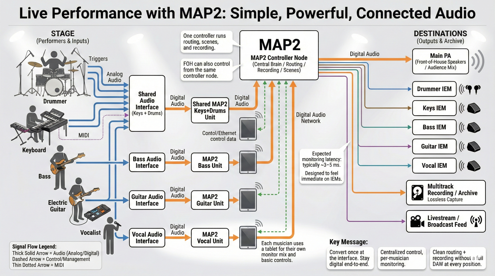

> [!IMPORTANT]
> **Why? It started as a digital pedal board**
>
> Most modern bands are already operating in a digital signal chain. Guitar modelers, digital mixers, drum triggers, MIDI controllers, resulting in in-ear systems, Front-Of-House Mix, Multitrack, or ReAmpable Signals.
>
> Every modern capture of a musical instrument, everything, converts to digital almost immediately.
>
> So, With A LOT of help from AI I have used open-source technologies to extend that idea to its logical conclusion:
>
> **What? Effects Processor that scales in all directions. Open-source. Headless Appliance**
>
> Imagine a centralized digital audio backbone with sufficient I/O to handle the entire band simultaneously-microphones, line inputs, MIDI keyboards, drum triggers, amp modelers-everything. Every performer plugs into the same system. All routing, monitoring, processing, and recording happen inside a shared digital environment.
>
> No redundant interfaces. No repeated A/D and D/A conversions. No audio leaving and re-entering the digital domain.
>
> The signal path remains coherent, clocked, and lossless from input to archive. That's technically optimal.
>
> However, placing a full desktop DAW in every rehearsal room, studio, or performance space is expensive, fragile, and operationally heavy. A general-purpose Desktop PC introduces unnecessary overhead: OS maintenance, UI complexity, background processes, and failure points that have nothing to do with audio. Musicians love an appliance.
>
> **How: This is where Mackes Audio Platform 2 (MAP2) (A platform installed on Fedora Server OS) fits.**
>
> Use a SFF PC to place two NODEs in one Audio Rack Space. Supercomputer Audio Superpowers.
>
> MAP2 provides the core advantages of a unified digital environment-centralized I/O, shared routing, synchronized processing, direct capture-without the bulk and instability of a full computer-based DAW at every node. Every node auto-connects over AVB (over Ethernet) if the NIC is available, and/or creates a full clustered API experience for management at all levels.
>
> Think of it as a purpose-built digital audio infrastructure rather than a workstation. It's not "a DAW in every room." It's a shared, deterministic audio platform (1 Node, or 100 Nodes) that every member of the band uses as a personal Digital Signal Chain or 10, and these live in real-time on, or accost nodes.
>
> One universal platform to rule them all. LV2 (VST3 Windows and Linux Capable), NAM, Convolution Reverb, Modulation, Filter, and Time effects are all native and built.
>
> One SFF PC, Gen 7 I5, 16GB RAM, 40GB Disk = 25+ real-time effects in a stereo stream (Lab, Educational Testing Only).
>
> Then Multiply by faster machines, more ram, more machines.
>
> It is a fun project, maintained by one person.
>
> It continues to allow me to train on DevSecOps principles and AI methods, while building something I enjoy tinkering with.
>
> Thank you - Matt


<p align="center">
  
</p>

<p align="center">
  
</p>

<h3 align="center">Professional Real-Time Modular Audio Processing</h3>

<p align="center">
  64-sample theoretical floor (2.67 ms @ 48 kHz) &bull; Measured 4-7 ms on the current audit host &bull; Neural Amp Modeling &bull; Multi-node clustering
</p>

<p align="center">
  <a href="https://github.com/matthewmackes/map2-audio/actions"></a>
  <a href="https://github.com/matthewmackes/map2-audio/stargazers"></a>
  <a href="https://github.com/matthewmackes/map2-audio/network/members"></a>
  <a href="https://github.com/matthewmackes/map2-audio/issues"></a>
  
  
</p>

---

<p align="center">
  
</p>

## Quick Navigation

- [Platform Overview](#platform-overview)
- [Architecture and Stack](#architecture-and-stack)
- [Setup and Launch](#setup-and-launch)
- [Repository Snapshot](#repository-snapshot)
- [Contributing](#contributing)
- [Legal](#legal)

---

## Platform Overview

**MAP2** (Mackes Audio Platform 2) is an enterprise-grade, real-time audio processing system that transforms commodity Linux hardware into a professional-grade guitar/audio processor. It combines a **C++ JUCE audio engine**, **Python FastAPI backend**, and **React web dashboard** into a unified platform.

> [!IMPORTANT]
> The MAP2 web GUI supports large-phone portrait and larger displays. Very small mobile screens and heavily reduced browser windows are not supported. The current minimum supported viewport is `560x917`.

### Operating Modes

| Mode | Latency | Description |
|:-----|:--------|:------------|
| **Audio** | 2.67 ms theoretical floor; 4-7 ms measured on current audit host | Dedicated processing on isolated CPU cores. No web UI. |
| **All-in-One** | 4-7 ms realistic today | Audio processing + web dashboard + management. |
| **Management** | N/A | Control-only node for cluster administration. |

### Signal Chain

```
Input -> NAM (Neural Amp) -> Modulation (11 types) -> Cabinet IR -> EQ ->
Gate -> Compressor -> Limiter -> Reverb IR -> Output
```

All processing runs on isolated CPU cores with `SCHED_FIFO` real-time priority, PipeWire/JACK audio transport, and configurable buffer sizes down to 64 samples at 48kHz.

---

## Architecture and Stack

| Layer | Technology |
|:------|:-----------|
| Audio Engine | C++ / JUCE 8.0.0, Neural Amp Modeler |
| Backend API | Python / FastAPI, SQLite, Uvicorn |
| Web Dashboard | React 19, Material UI 7, Vite |
| Terminal UIs | Python / Textual, React / Ink |
| Audio Server | PipeWire via JACK protocol |
| OS / RT | Fedora Linux, isolated CPU cores, SCHED_FIFO |
| Clustering | Multi-node with AVB/802.1AS support (installed by default; removable) |
| Hardware | USB audio interfaces (Edirol UA-1000, Hotone Jogg) |

---

## Setup and Launch

```bash
# Clone the repo
git clone https://github.com/matthewmackes/map2-audio.git
cd map2-audio

# Full installation on Fedora Server 42+
sudo bash install_on_new_host.sh

# Optional install variants
sudo bash install_on_new_host.sh --skip-avb         # Install MAP2 without AVB setup
sudo bash install_on_new_host.sh --uninstall-avb    # Remove AVB configuration after rebuild

# Or start individual components
systemctl start map2-backend          # Backend API (port 8080)
./scripts/start_web.sh                # Web dashboard (port 3000)
python -m tui.node_console            # Textual management console
./map2-tui                            # Ink TUI launcher (opens Signal Chains Live)
./map2-tui --list-screens             # Show available Ink screens
./map2-tui --screen diagnostics       # Launch Ink TUI on a specific screen
```

<details>
<summary><strong>Build from source (C++ engine)</strong></summary>

```bash
cd juce-engine
cmake -B build -DCMAKE_BUILD_TYPE=Release
cmake --build build
```

Requires: CMake 3.22+, GCC 12+ or Clang 15+, JUCE dependencies (ALSA, freetype, etc.)

</details>

---

## Repository Snapshot

> [!NOTE]
> The sections below are updated automatically by repository workflows.

### Project Stats

<!-- PROJECT-STATS:START -->
**1475** Python | **1485** TypeScript | **179** C++/H | **146** Docs | **3680** total commits | **3** stars | **0** forks | **0** open issues
<!-- PROJECT-STATS:END -->

---

### Recent Documentation

<!-- RECENT-DOCS:START -->
| Document | Last Updated |
|:---------|:------------|
| [PROJECT WORKLIST](https://github.com/matthewmackes/map2-audio/blob/master/docs/PROJECT_WORKLIST.md) | 2026-05-03 |
| [MAP2 Renames — Migration Notes](https://github.com/matthewmackes/map2-audio/blob/master/docs/RENAMES.md) | 2026-05-03 |
| [MAP2 Audio Platform — AI Instructions](https://github.com/matthewmackes/map2-audio/blob/master/docs/CLAUDE.md) | 2026-05-02 |
| [MAP2 Backend Runtime Contract](https://github.com/matthewmackes/map2-audio/blob/master/docs/backend-runtime-contract.md) | 2026-04-27 |
| [MAP2 API Contract Standards](https://github.com/matthewmackes/map2-audio/blob/master/docs/api-contract-standards.md) | 2026-04-25 |
| [MAP2 LCD Console — Operator Guide](https://github.com/matthewmackes/map2-audio/blob/master/docs/LCD_OPERATOR_GUIDE.md) | 2026-04-23 |
<!-- RECENT-DOCS:END -->

<p align="right"><a href="https://github.com/matthewmackes/map2-audio/tree/master/docs">Browse all docs &rarr;</a></p>

---

### Gallery

<!-- GALLERY:START -->
|  |  |  |
| :---: | :---: | :---: |
|  |  |  |
|  |  |  |
|  |  |  |
<!-- GALLERY:END -->

<p align="right"><em>Add screenshots to <code>docs/images/</code> and they appear here automatically.</em></p>

---

### Recent Activity

<!-- RECENT-ACTIVITY:START -->
| Commit | Message | Author | Date |
|:-------|:--------|:-------|:-----|
| [`74c6a059`](https://github.com/matthewmackes/map2-audio/commit/74c6a059aa97798d170938a5ab267a092edb6e26) | chore(worklist): close out T_RENAME — all 7 slices shippe... | Map2 Audio | 2026-05-03 |
| [`86413067`](https://github.com/matthewmackes/map2-audio/commit/86413067ba595cc6f9e9208ca83bc31e4c8e3d45) | fix(sequencer): align query keys with runtime hook + rest... | Map2 Audio | 2026-05-03 |
| [`63217a40`](https://github.com/matthewmackes/map2-audio/commit/63217a40b2689886de9f10cd14bd40cedbd538ec) | test(rename+prefetch): T_RENAME label fix + AVB prefetch ... | Map2 Audio | 2026-05-03 |
| [`0106ac2a`](https://github.com/matthewmackes/map2-audio/commit/0106ac2a14590d3e00f7a382904518ae7cef099b) | chore: auto-update README with latest docs & activity | matthewmackes | 2026-05-03 |
| [`b2e4bfbc`](https://github.com/matthewmackes/map2-audio/commit/b2e4bfbcb06b89262282aa41cda03e81d184f67d) | refactor(rename): Brain / Drums&Synth / Performance Brain... | Map2 Audio | 2026-05-03 |
| [`6a6f4cd5`](https://github.com/matthewmackes/map2-audio/commit/6a6f4cd53f2d16f300d4d9e716b4780580401108) | chore: auto-update README with latest docs & activity | matthewmackes | 2026-05-03 |
| [`ed189b70`](https://github.com/matthewmackes/map2-audio/commit/ed189b70699d92521b2e7f048328cc1aebd42215) | refactor(nav): merge /chains into /node-ops/audio-engine ... | Map2 Audio | 2026-05-03 |
| [`51f606db`](https://github.com/matthewmackes/map2-audio/commit/51f606dbf842340872308cbf52e1e96d9ab3ee2a) | refactor(nav): canonical /node-ops + /artifacts + /about ... | Map2 Audio | 2026-05-03 |
<!-- RECENT-ACTIVITY:END -->

---

### Built With

<!-- CREDITS:START -->
| Project | Role |
|:--------|:-----|
| [JUCE](https://juce.com/) | C++ audio framework |
| [PipeWire](https://pipewire.org/) | Linux multimedia server |
| [JACK](https://jackaudio.org/) | Audio connection kit |
| [FastAPI](https://fastapi.tiangolo.com/) | Python web framework |
| [React](https://react.dev/) | UI library |
| [Material UI](https://mui.com/) | React component library |
| [Neural Amp Modeler](https://github.com/sdatkinson/NeuralAmpModelerPlugin) | ML amp modeling |
| [Textual](https://textual.textualize.io/) | Python TUI framework |

...and **37** more open-source packages from PyPI and npm.
<!-- CREDITS:END -->

---

## Contributing

MAP2 is an ambitious project at the intersection of real-time audio, embedded systems, and modern web technologies. Contributions are welcome in any area:

- **Audio/DSP** - Plugin development, latency optimization, new effects
- **Backend** - API endpoints, service orchestration, cluster management
- **Frontend** - React dashboard, pedalboard editor, real-time meters
- **Infrastructure** - Packaging, deployment, CI/CD, documentation

```bash
# Development setup
pip install -r requirements.txt       # Python backend
npm install                           # Web frontend
cd juce-engine && cmake -B build      # C++ engine
```

---

## Legal

MAP2-owned code in this repository is licensed under the **GNU Affero General Public License v3.0** (`AGPL-3.0-only`). Educational and research framing in this repository describes intent, but does not add restrictions beyond AGPLv3.

Source availability path for MAP2-owned code is this repository. If you deploy a modified running version, publish the corresponding source for that version in an accessible location for your users.

If you modify and run this software for users over a network, you must provide the corresponding source code for that running version as required by AGPLv3.

Third-party components remain under their original licenses and are not relicensed by MAP2. See:

- `LICENSE`
- `docs/THIRD_PARTY_NOTICES.md`

See the full [Legal Disclaimer](docs/%23%20LEGAL%20DISCLAIMER%20%E2%80%93%20IMPORTANT%20NOTICE.md) for complete details.

---

<p align="center">
  <strong>MAP2 Modular Audio Platform</strong><br>
  <sub>Professional real-time audio processing for Linux</sub>
</p>
