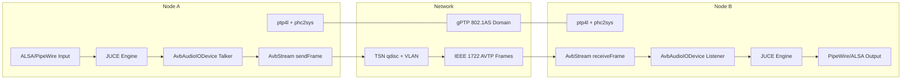
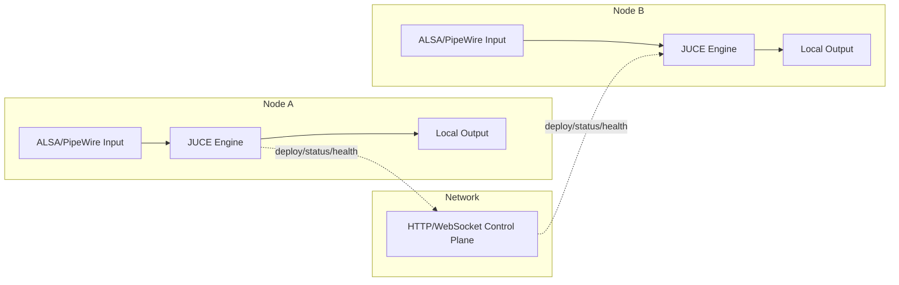

# AVB / 802.1AS vs Non-AVB Signal Flow Comparison

## Purpose
This document gives a codebase-grounded template for drawing two-node signal flows:
1. With AVB + IEEE 802.1AS (gPTP)
2. Without AVB + IEEE 802.1AS

It also clarifies whether these are the only possibilities and provides checkpointed steps for interruption-safe diagram work.

## Verified From Current Codebase
- AVB is optional and disabled by default.
  - `app/config.py` (`avb.enabled`, default `False`)
  - `docs/avb-setup.md` ("optional", "disabled by default")
- AVB availability is runtime-gated by config + interface + `ptp4l`.
  - `app/services/avb/__init__.py` (`is_avb_available`)
- AVB status endpoints are always mounted and degrade gracefully when unavailable.
  - `app/main.py`, `app/routes/avb.py`
- Non-AVB cluster behavior is control-plane deployment, not deterministic inter-node audio transport.
  - `app/services/flow_orchestrator.py` (HTTP deploy to `/api/chains/deploy`)
  - `app/routes/chains.py` (`/deploy` currently accepts/echoes request)

## Are There Only Two Possibilities?

### Answer
For the **inter-node audio data path**, yes: there are two practical modes.
1. AVB/802.1AS data path active (deterministic, synchronized transport)
2. No AVB/802.1AS data path (local audio per node, control traffic only between nodes)

For the **overall system state**, no. There are multiple readiness states:
- AVB compiled out (`USE_AVB=OFF`)
- AVB compiled in but runtime disabled (`avb.enabled=false`)
- AVB enabled but unavailable (NIC/deps missing)
- AVB enabled with partial readiness (PTP or TSN not healthy)
- AVB enabled and operational

## How To Draw Detailed Signal Flow

Use a 3x3 layout:
- Vertical lanes: `Node A | Network | Node B`
- Horizontal planes: `Clock/Sync | Audio Data | Control`
- Arrow styles:
  - Solid thick: active audio data
  - Solid medium: active clock/sync
  - Dashed: control/management traffic
  - Dotted: planned or placeholder implementation

Label each hop with:
- Interface/protocol
- Typical timing target
- Failure signal (what endpoint/metric detects breakage)

## Comparison Table

| Dimension | AVB + 802.1AS | Without AVB + 802.1AS |
|---|---|---|
| Inter-node audio transport | Layer-2 AVTP stream path | No deterministic inter-node audio path |
| Time sync | gPTP/802.1AS | No shared PTP clock domain |
| Determinism | Bounded latency/jitter target | Best-effort only |
| Traffic shaping | TSN qdisc (mqprio/CBS/ETF) | Standard networking |
| Node relationship | Talker/listener endpoints | Independent local engines |
| Cluster traffic | Control + AVB status/discovery | Control only (deploy/health/API) |
| Failure mode | Falls back to unavailable/error states | Continues local processing only |
| Observability | `/api/avb/*` + stream stats | `/api/audio-path/*` + cluster deploy status |

## Draw-Ready Mermaid: With AVB + 802.1AS

## Draw-Ready Mermaid: Without AVB + 802.1AS

## Implementation Reality Notes (Use Dotted Blocks In Diagram)
- AVB router API references `get_avb_router`, and factory wiring is implemented with graceful fallback and late binding.
- Cluster flow deployment enforces active/standby response semantics, reports degraded standby failures, uses activation-before-commit standby promotion, and replenishes standby assignments toward pre-failover redundancy level; broader standby rebalancing is still partial.
- AVB stream lifecycle/stat hooks are implemented in Python service/routes, with fail-fast signaling when engine stream hooks are missing; C++ AVB dataplane internals remain partial.

Mark these as "planned/in-progress" to avoid presenting partial code as fully operational.

## Checkpoints (Interruption Safe)
1. Checkpoint A: Confirm mode matrix
   - Verify `USE_AVB`, `avb.enabled`, `is_avb_available`, PTP status, TSN status.
2. Checkpoint B: Draw baseline boxes
   - Node A, Network, Node B with three planes.
3. Checkpoint C: Draw AVB path
   - Add clock sync path, AVTP path, TSN shaping labels.
4. Checkpoint D: Draw non-AVB path
   - Keep local audio only; add control-plane-only inter-node arrows.
5. Checkpoint E: Add observability and failure labels
   - Annotate API endpoints and expected unavailable/degraded indicators.
6. Checkpoint F: Add implementation-status overlays
   - Dotted blocks for placeholder/incomplete sections.

## Suggested Annotation Pack
- Latency labels:
  - AVB: "target <2 ms end-to-end"
  - Non-AVB inter-node: "best effort, non-deterministic"
- Health labels:
  - `available=false` on AVB endpoints when unavailable
  - audio-path health via `/api/audio-path/local`
- Config labels:
  - `MAP2_AVB_ENABLED`, `MAP2_AVB_INTERFACE`
