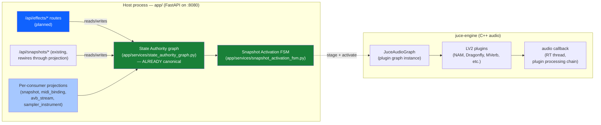
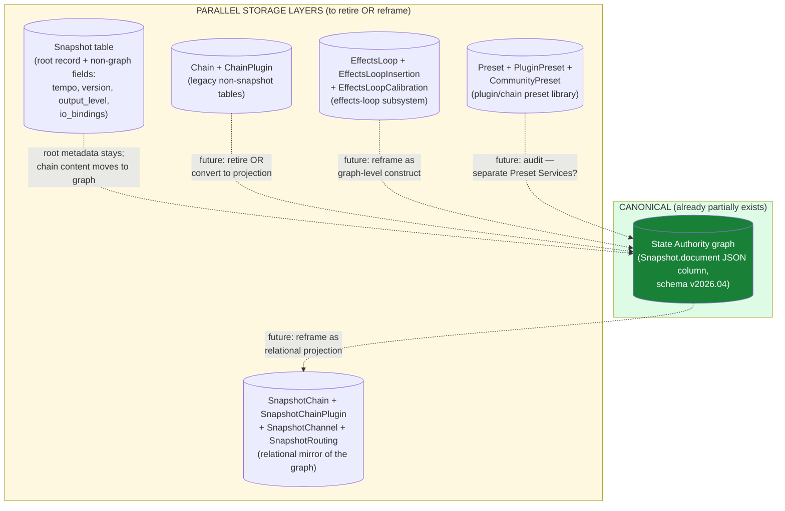
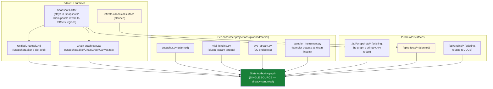
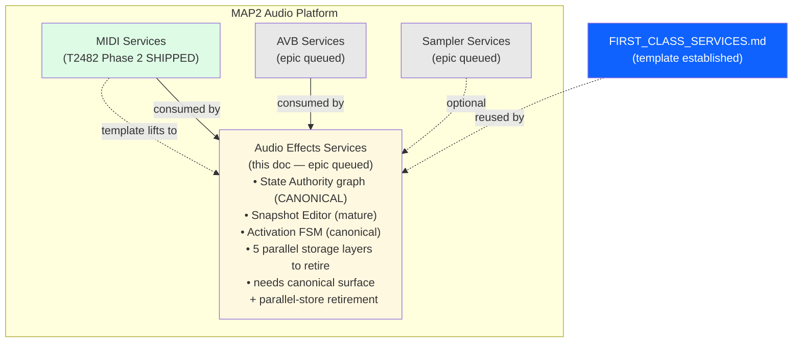

# Audio Effects Services — first-class platform service offering (epic stub)

**Status**: Epic stub — full design + execution pending. Architecture doc + 5 architectural diagrams provided as the starting point for the future epic per the 2026-05-01 user directive.
**Template**: This doc lifts the structure from `docs/architecture/MIDI_SERVICES.md` (the reference implementation) and customizes for Audio Effects. See `FIRST_CLASS_SERVICES.md` for the unification pattern + the 9-step process for opening a first-class-services epic.

---

## 1. The four-services framing position

Audio Effects is one of the four first-class platform service offerings (MIDI / AVB / Sampler / **Audio Effects**). It owns the chain graph — plugins, parameters, automation, insertions, effects loops, A/B comparison, snapshot persistence, and the runtime activation FSM that ships chain state to the JUCE audio engine.

**Today's state** (2026-05-01) — **most-mature of the four; partial unification already exists**:
- **State Authority graph** (`app/services/state_authority_graph.py`): canonical version `2026.04`, schema at `schemas/snapshot-graph-v1.schema.json`. Already used by the Snapshot Editor as the canonical chain/plugin representation.
- **Snapshot Activation FSM** (`app/services/snapshot_activation_fsm.py`): canonical state machine for snapshot activation transitions (Idle → Staging → Activating → Live → Failed).
- **Snapshot Editor** (`web/src/app/components/SnapshotEditor/` + `SnapshotEditorPageContent.tsx`): canonical chain authoring surface. ~8,500 LOC after the T2467-T2473 decomposition.
- **JUCE engine** (`juce-engine/Source/`): owns the live plugin graph in the audio callback. State sync via `JuceAudioGraph` + `Map2AudioEngine`.
- **Multiple parallel storage layers**:
  - `Snapshot` table — root snapshot record (name, document JSON, controls_payload, etc.)
  - `SnapshotChain` + `SnapshotChainPlugin` + `SnapshotChannel` + `SnapshotRouting` — relational shape
  - `Chain` + `ChainPlugin` (legacy non-snapshot chain table)
  - `Preset` + `PluginPreset` + `CommunityPreset` (plugin/chain preset tables)
  - `EffectsLoop` + `EffectsLoopInsertion` + `EffectsLoopCalibration` (effects-loop subsystem)
  - State Authority graph document (lives inside `Snapshot.document` JSON column)
- **No standalone Audio Effects surface**: chain authoring lives in Snapshot Editor; chain runtime state is split between snapshot service + JUCE engine.

**Cross-service consumer relationships**:
- **Audio Effects consumes MIDI** (the most common pattern — MIDI bindings drive plugin parameters via the `plugin_param` consumer in MIDI Services).
- **Audio Effects consumes AVB** (input/output streams feed/drain the chain).
- **Audio Effects consumes Sampler** (a sampler output can feed a chain).

---

## 2. Unification scope (when the epic opens)

**Canonical authority**: extend State Authority graph to be **the** canonical for chains/plugins/parameters/automation/insertions/loops. The graph schema is already at v1; the unification work is reframing every parallel storage layer as a projection over the graph (or absorbing it).

**Canonical surface**: `/effects` mount (final naming TBD — could be `/chains`, `/audio`, etc.). Single entry point for chain authoring, plugin browsing, parameter automation, A/B comparison, effects-loop calibration. The Snapshot Editor's chain authoring panels become regions of this surface.

**Migration**:
- Audit which parallel storage layers (Chain, ChainPlugin, EffectsLoop, etc.) carry data not already represented in the State Authority graph; lift any unique data into graph extensions; delete the parallel tables.
- Audit which JUCE engine state needs to be mirrored vs derived from the graph.
- Lift the Snapshot Editor's chain authoring concerns into the canonical surface.

**Inventory (preliminary, very high-level — actual epic will need a more thorough audit)**:
- State Authority graph → already canonical, needs minor extensions for chain-level concerns
- Snapshot Editor chain authoring panels → absorbed into `/effects` regions
- Chain + ChainPlugin tables (legacy, non-snapshot) → audit + retire OR convert to projection
- Preset + PluginPreset + CommunityPreset tables → audit + decide whether they're Audio Effects concerns or a separate Preset Services concern
- EffectsLoop subsystem → reframed as a chain-level construct in the graph
- JUCE engine plugin graph → derived from the graph at activation time (already mostly true)

**Unique to Audio Effects vs the other 3 services**: the canonical authority **already exists** and is **already in use**. The unification work here is less "build a new authority" and more "audit the parallel layers, retire what's redundant, formalize the surface."

---

## 3. Architectural diagrams (5 required views)

### 3.1 Process topology

(State Authority + Activation FSM are green = already canonical. The new work is the canonical surface + parallel-layer retirement, not building the authority from scratch.)

### 3.2 Storage layout

### 3.3 Consumer surface

### 3.4 Migration narrative

```mermaid
flowchart LR
    subgraph today["TODAY (2026-05-01)"]
        graph_done["State Authority graph v2026.04\n(SHIPPED, in use)"]
        activation_done["Activation FSM\n(SHIPPED)"]
        snapshot_editor_done["Snapshot Editor\n(8500 LOC, decomposed T2467-T2473)"]
        parallel_layers["5 parallel storage layers\nstill present"]
    end

    subgraph future_p1["Audio Effects Services Phase 1"]
        backend_audit["Backend audit:\nwhich parallel layers carry\nunique data vs derived"]
        graph_extensions["State Authority graph extensions\n(if needed for chain-level concerns)"]
    end

    subgraph future_p2["Audio Effects Services Phase 2"]
        projection_layer["Per-consumer projections\n(snapshot, midi_binding,\navb_stream, sampler_instrument)"]
        legacy_retirement["Parallel-layer retirement:\nChain + ChainPlugin → projection;\nEffectsLoop → graph extension;\nPresets → audit (separate service?)"]
        verification["Verification suite\n(round-trip + activation\ngolden tests)"]
    end

    subgraph future_p3["Audio Effects Services Phase 3 (frontend)"]
        canonical_surface["/effects canonical mount"]
        snapshot_editor_reframe["Snapshot Editor chain panels\nreframed as /effects regions\n(stays in place visually,\nbackend rewires through projection)"]
    end

    subgraph future_p4["Audio Effects Services Phase 4"]
        template_lift["Template lifted from\nFIRST_CLASS_SERVICES.md\n(MOST-IMPORTANT diagram update:\nshow how the partial unification\nbecame full)"]
    end

    graph_done --> backend_audit
    snapshot_editor_done --> backend_audit
    parallel_layers --> backend_audit
    activation_done --> projection_layer
    backend_audit --> graph_extensions
    graph_extensions --> projection_layer
    projection_layer --> legacy_retirement
    legacy_retirement --> verification
    verification --> canonical_surface
    canonical_surface --> snapshot_editor_reframe
    snapshot_editor_reframe --> template_lift

    style today fill:#defbe6
    style graph_done fill:#198038,color:#fff
    style activation_done fill:#198038,color:#fff
    style future_p1 fill:#fff8e1
    style future_p2 fill:#fff8e1
    style future_p3 fill:#e8e8e8
    style future_p4 fill:#e8e8e8
```

### 3.5 Four-services framing position

---

## 4. References

- `docs/architecture/FIRST_CLASS_SERVICES.md` — the template this doc lifts from
- `docs/architecture/MIDI_SERVICES.md` — reference implementation
- `app/services/state_authority_graph.py` — already-canonical State Authority graph
- `app/services/snapshot_activation_fsm.py` — Activation FSM
- `schemas/snapshot-graph-v1.schema.json` — graph schema v2026.04
- `web/src/app/components/SnapshotEditor/` — Snapshot Editor (8500 LOC, decomposed)
- `juce-engine/Source/JuceAudioGraph.cpp` — JUCE plugin graph instance
- `~/.claude/projects/-home-mm-map2-audio/memory/project_state_authority.md` — State Authority redesign
- `~/.claude/projects/-home-mm-map2-audio/memory/project_snapshoteditor_decomposition.md` — Snapshot Editor T2467-T2473 epic
