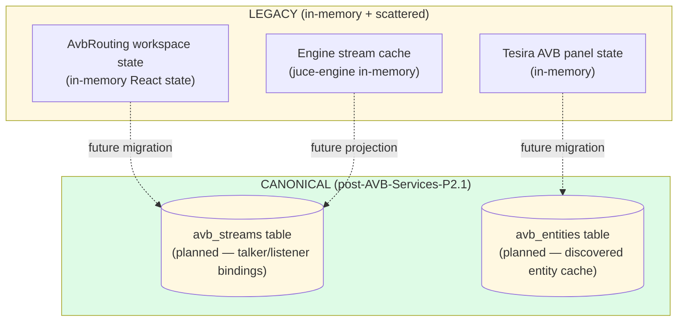
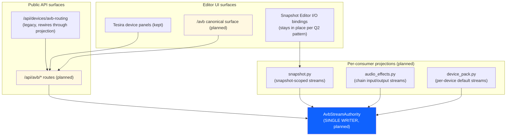
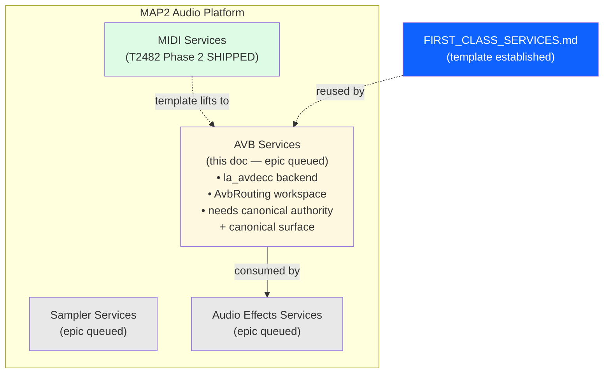

# AVB Services — first-class platform service offering

**Status:** T2490 epic OPENED 2026-05-02. This doc was written as a stub on 2026-05-01 with 5 architectural diagrams; T2490 kickoff (2026-05-02) upgrades it in place to the live design doc by adding the locked decisions, refined data model, and sub-task plan.
**Template:** This doc lifts the structure from `docs/architecture/MIDI_SERVICES.md` (the T2482 reference implementation) and customizes for AVB. See `FIRST_CLASS_SERVICES.md` for the unification pattern + the 9-step process for opening a first-class-services epic.

---

## 0. T2490 locked decisions (2026-05-02)

The 5-question protocol locked five answers at epic kickoff. Each decision is the canonical reference for downstream sub-tasks.

| Q | Decision |
|---|---|
| **Q1** | **A — `/avb/*` canonical mount.** Equal-citizen status with `/midi/*`. Legacy `/devices/tesira/*` and `/tesira` hard-redirect (Q1=A from T2485 carried forward as the redirect default for service-unification epics). |
| **Q2** | **B — `AvbBindingAuthority` pattern.** Refactor `app/services/avb/avb_router.py`'s 2,630-LoC routing-matrix logic around a canonical "binding" data model analogous to T2482's `MidiBinding` table. The authority owns talker/listener pairings, AVDECC stream connections, and Tesira preset/design recall as canonical bindings. Operator-visible UI reads/writes through one authority. |
| **Q3** | **A — Tesira folds entirely under `/avb/*`.** `/avb/devices/tesira/*` becomes the canonical mount; legacy `/devices/tesira/*` and `/tesira` hard-redirect. The TesiraFleet authority refactors to register with `AvbBindingAuthority`. SageVue design workspace stays as the design-time surface but registers its outputs as bindings under the unified authority. |
| **Q4** | **A — Full cluster parity with MIDI.** Ship `/api/avb/cluster/bindings/matrix` (concurrent peer fan-out + 2s timeout, mirroring T2484), `/avb/network` UI page mirroring `/midi/network`, mDNS-driven peer discovery for AVB streams, peer-health surface with per-peer Carbon Tag tones. AVB cluster reconciliation joins the state-authority pattern. |
| **Q5** | **A — Kickoff commit ships worklist + design doc only.** No code in this kickoff. Subsequent T2490 sub-tasks pick up implementation slices. |

**la_avdecc / custom AVDECC dispute resolution.** Pre-audit notes claimed a "custom AVDECC controller still present" — that was a misread. The truth: la_avdecc v4.x is already the canonical AVDECC controller (T376 retired the custom `AvdeccEntity*` stack). `juce-engine/Source/AvdeccController.cpp` is the la_avdecc-backed wrapper; `app/services/avb/avb_router.py` is a higher-level Python routing-matrix orchestrator that *consumes* the controller. T2490 does not touch the controller stack.

---

## 1. The four-services framing position

AVB is one of the four first-class platform service offerings (MIDI / **AVB** / Sampler / Audio Effects). It owns audio-over-Ethernet (IEEE 1722 AVTP) — stream discovery, talker/listener binding, format negotiation, AVDECC entity model, and PTP sync.

**Today's state** (2026-05-01):
- **Backend**: `la_avdecc` v4.3.1.1 (L-Acoustics, GPLv3) integrated in the JUCE engine via `juce-engine/Source/AvdeccController.h/cpp` (`Map2AvdeccController` class). Single canonical AVDECC controller per JUCE engine instance. Observer-pattern entity discovery; async→sync bridge for stream operations.
- **Frontend**: `web/src/app/components/AvbRouting/` workspace exists with routing matrix + topology + entity inspector. Per the T2475 (MUI removal) ship report, AvbRouting still has Carbon migration debt (RoutingGrid subsystem uses MUI palette literals).
- **Tesira AVB**: Tesira device panels under `web/src/app/components/Devices/Tesira/` overlap with AVB (Tesira IS an AVB device); the AVB plane is the audio transport, the TTP plane is the control protocol — separate concerns.
- **Engine integration**: `MAP2_AVB_INTERFACE` env var sets the network interface (default `eth0`). `AVB stream config bufferSize=256` is the AVTP packet size, **not** the audio callback buffer (that's 64).

**Cross-service consumer relationship**: Audio Effects consumes AVB. An AVB input stream feeds the chain graph; chain output absorbs into an AVB output stream.

---

## 2. Unification scope (when the epic opens)

**Canonical authority**: `AvbStream` table — every AVDECC stream binding (talker entity_id + stream_id → listener entity_id + stream_id) lives here. Plus an `AvbEntity` cache for discovered entities. Provenance: `source` + `metadata.legacy_*` fields per the four-services template.

**Canonical surface**: `/avb` mount (final naming TBD). Single entry point for stream management, entity discovery, format negotiation, fault diagnosis. Old `/devices/avb-routing` redirects.

**Migration**: lift any in-memory `AvbRouting` workspace state + Tesira AVB panel state + engine-side stream cache into canonical rows.

**Inventory (T2490 kickoff audit, 2026-05-02)**:

| Surface | LoC / file count | Disposition |
|---|---|---|
| `app/routes/avb/{routing,discovery,metrics,common}.py` | 4,104 LoC | Consolidate under one `/api/avb/*` prefix; `bindings.py` added in T2490-2 |
| `app/routes/tesira.py` | 1,789 LoC | Re-mount under `/api/avb/devices/tesira/*` in T2490-6 |
| `app/services/avb/` | 10 files, 7,172 LoC | `binding_authority.py` added in T2490-2; `avb_router.py` becomes a projection in T2490-3 |
| `app/services/tesira/` | 20 files, 6,238 LoC | TesiraFleet adapter registers with `AvbBindingAuthority` in T2490-6 |
| `web/src/app/components/Devices/Tesira/` | 8 components | Move to `web/src/app/components/Devices/Tesira/` (path unchanged); mounted under `/avb/devices/tesira` instead of `/devices/tesira` |
| `web/src/app/components/AvbRouting/` | (preserved) | Absorbed into `/avb/routing` region in T2490-8 |
| `juce-engine/Source/AvdeccController.{h,cpp}` | 741 LoC | Unchanged — la_avdecc-backed canonical |

---

## 2.3 Sub-task plan

10 sub-tasks across 5 phases; 17–20 SHIP iters total. Each sub-task ships independently with typecheck + jest + atomic build + dual-push gates.

| Sub-task | Iters | Description |
|---|---|---|
| **T2490-1** Operator mount scaffold | 1 | `web/src/app/pages/AvbServicesShell.tsx` + `/avb/*` route + menu entry. Empty placeholder index → connections. |
| **T2490-2** AvbBindingAuthority data model | 2-3 | `app/services/avb/binding_authority.py` + `app/routes/avb/bindings.py` + migrations + tests. |
| **T2490-3** `avb_router.py` refactor | 3 | Routing matrix becomes a projection of the authority. Three slices: matrix → projection → cleanup. |
| **T2490-4** Connections page | 1 | Carbon DataTable mirroring `MidiServicesConnectionsPage`. |
| **T2490-5** Devices region | 1-2 | `/avb/devices` index + `/avb/devices/:profileKey` per-device landing. |
| **T2490-6** Tesira fold-in | 3-4 | Migrate `/devices/tesira/*` → `/avb/devices/tesira/*`; TesiraFleet adapter registers with authority. Largest single sub-task. |
| **T2490-7** Cluster matrix | 2 | `/api/avb/cluster/bindings/matrix` + `usePeerMatrix` + drill-down drawer. |
| **T2490-8** Routing region | 1 | `/avb/routing` matrix UI; absorbs `web/src/app/components/AvbRouting/`. |
| **T2490-9** Network region | 2 | `/avb/network` (PTP, SRP, TSN, mDNS peers) + cluster auto-connect onboarding modal (T2486 pattern). |
| **T2490-10** Closeout | 1 | Legacy route deletion, evidence run, doc updates, test totals. |

---

## 2.4 The `AvbBinding` data model (T2490-2)

The cornerstone of T2490 is a single canonical binding model that owns every operator-visible AVB intent. Mirrors `MidiBinding` from T2482 with AVB-specific fields:

```python
# app/services/avb/binding_authority.py (T2490-2)

@dataclass
class AvbBinding:
    # Identity (mirrors MidiBinding)
    binding_id: str           # UUID
    binding_kind: str         # "stream" | "preset" | "design" | "tesira_block"
    enabled: bool
    scope: str                # "host" | "node" | "cluster"
    scope_id: Optional[str]   # node_id when scope="node"
    consumer_id: Optional[str]  # device-pack profile_key when binding lives under a device

    # Source side (talker)
    talker_node_id: str
    talker_entity_id: str     # AVDECC entity ID (8-byte hex)
    talker_stream_index: int  # OUTPUT_STREAM index on the talker

    # Sink side (listener)
    listener_node_id: str
    listener_entity_id: str
    listener_stream_index: int  # INPUT_STREAM index on the listener

    # Stream parameters
    stream_format: str        # AAF-PCM-INT-32_48000_8 etc.
    srp_class: str            # "A" | "B"
    presentation_offset_ns: int  # PTP-relative

    # Tesira-specific projection (binding_kind in {preset, design, tesira_block})
    tesira_fleet_id: Optional[str]
    tesira_device_id: Optional[str]
    tesira_block_path: Optional[str]
    tesira_preset_program: Optional[int]

    # Provenance
    created_at: datetime
    created_by_node: str
    last_modified_at: datetime
    last_modified_by_node: str
    runtime_extra: dict       # transport, schema_version, migrated_from, etc.
```

**Single writer rule:** `AvbBindingAuthority.write()` is the only mutation path. The la_avdecc-backed controller, the avb_router projection, the TesiraFleet adapter, and the cluster reconciler all *consume* the authority.

**Cluster-aware from day one:** every binding carries `talker_node_id` + `listener_node_id` (already in `AvbStreamConfig` today). REST surface accepts a `node_id=` query for projection scoping (mirrors the MIDI pattern).

---

## 2.5 Migration strategy

### 2.5.1 Talker/listener stream pairings (T2490-3 — Phase 1's largest migration)

`avb_router.py` keeps its routing matrix in process-singleton state today. Migration is two slices:

1. **T2490-3 slice A:** `AvbBindingAuthority` reads from `avb_router.py`'s state on init, populating the binding table with one binding per active talker/listener pairing. Provenance preserved (`created_by_node = self.node_id`, `runtime_extra.migrated_from = "avb_router_singleton"`).
2. **T2490-3 slice B:** `avb_router.py` flips its mutation paths to write through the authority. The internal singleton becomes a read-only cache fed by authority updates.
3. **T2490-3 slice C:** dead-code cleanup of legacy mutation paths.

### 2.5.2 Tesira preset/design migration (T2490-6 — Phase 2)

TesiraFleet's preset library and SageVue design workspace currently keep state in `app/services/tesira/`. Migration:

1. **T2490-6 slice A:** TesiraFleet adapter writes one binding per active fleet/device pairing (`binding_kind="tesira_block"`).
2. **T2490-6 slice B:** Preset recall flips to write through the authority. SageVue design compile outputs register as `binding_kind="design"` rows.
3. **T2490-6 slice C:** Legacy `app/services/tesira/` state files become read-only projections. Deprecation shim for one release cycle.
4. **T2490-6 slice D:** Frontend mount migration: `/devices/tesira/*` → `/avb/devices/tesira/*` with hard redirect.

### 2.5.3 Provenance preservation

Every migrated binding carries:
- `runtime_extra.migrated_from` — origin path (`avb_router_singleton` | `tesira_fleet_state` | `sagevue_compile_output`)
- `runtime_extra.migrated_at` — ISO timestamp
- `runtime_extra.legacy_id` — pre-migration identifier (so post-migration audits can trace any binding back)

### 2.5.4 Rollback

Migrations are reversible per the T2454 versioned-migration pattern. If a phase migration goes wrong, the authority reads back to the legacy state stores via the projection layer; the rollback migration deletes the binding rows but leaves `app/services/tesira/` and `avb_router.py` state intact.

---

## 2.6 Risk register

| # | Risk | Mitigation |
|---|---|---|
| 1 | la_avdecc API surface changes between v4.x point releases | Wrapper `AvdeccController.cpp` shields the Python authority. Any la_avdecc upgrade is a separate task. |
| 2 | Tesira adapter migration introduces preset-recall regressions | T2490-6 slice A runs in shadow mode (binding writes happen, but TesiraFleet keeps its existing state authority) for one release cycle before slice B flips the mutation path. |
| 3 | Cluster matrix endpoint blocks on slow peer | 2s per-peer timeout (matches T2484). |
| 4 | PTP/SRP/TSN status reads are slow | The authority exposes them via cached projections refreshed on a 2-second interval, not on every binding read. |
| 5 | Schema drift in `AvbBinding.runtime_extra` | The table is JSON; consumers tolerate unknown keys. Schema additions are additive only. |
| 6 | The 2,630-LoC `avb_router.py` refactor is bigger than the audit suggests | T2490-3 is scoped at 3 SHIP iters with explicit slice points. Each slice ships independently. |
| 7 | TesiraFleet adapter's 6,238 LoC of state is bigger than the binding model can absorb | Slice the migration: only `binding_kind in {preset, design, tesira_block}` rows go to the authority. Block-path live state stays in TesiraFleet's projection. |

---

## 3. Architectural diagrams (5 required views)

### 3.1 Process topology

```mermaid
flowchart LR
    subgraph host["Host process — app/ (FastAPI on :8080)"]
        avb_routes["/api/avb/* routes\n(planned — AVB Services)"]
        avb_authority["AvbStreamAuthority\n(planned — single writer)"]
        avb_projections["Per-consumer projections\n(snapshot, audio_effects,\ndevice_pack)"]
    end

    subgraph juce_engine["juce-engine (C++ audio)"]
        avdecc_controller["Map2AvdeccController\n(juce-engine/Source/AvdeccController.cpp)"]
        la_avdecc["la_avdecc v4.3.1.1\n(IEEE 1722 protocol layer)"]
        audio_callback["audio callback\n(RT thread,\nAVB streams in/out)"]
    end

    subgraph network["AVB Network (Ethernet, IEEE 1722)"]
        ptp["PTP sync\n(IEEE 802.1AS)"]
        avb_devices["AVB endpoints\n(Tesira, MOTU, QSC, etc.)"]
    end

    avb_routes -->|reads/writes| avb_authority
    avb_projections --> avb_authority
    avb_authority -.->|stream config\n(connect/disconnect/format)| avdecc_controller
    avdecc_controller --> la_avdecc
    la_avdecc <-->|IEEE 1722 + AVDECC AECP| ptp
    ptp <--> avb_devices
    la_avdecc -->|stream samples| audio_callback

    style avb_authority fill:#0f62fe,color:#fff
    style avb_routes fill:#0f62fe,color:#fff
    style avb_projections fill:#a6c8ff
    style avdecc_controller fill:#198038,color:#fff
```

### 3.2 Storage layout



(Light yellow boxes indicate planned work. The canonical tables don't exist yet — they ship as part of AVB Services Phase 2.)

### 3.3 Consumer surface



### 3.4 Migration narrative

```mermaid
flowchart LR
    subgraph today["TODAY (2026-05-01)"]
        la_avdecc_done["la_avdecc v4.3.1.1\nintegrated (2026-02-27)"]
        avb_routing_workspace["AvbRouting workspace\n(exists, partial Carbon migration)"]
        tesira_panels_done["Tesira device panels\n(exist, AVB context)"]
    end

    subgraph future_p1["AVB Services Phase 1"]
        backend_audit["Backend audit:\nstream cache + entity model"]
        canonical_design["AvbStream + AvbEntity\nschema design"]
    end

    subgraph future_p2["AVB Services Phase 2"]
        authority["AvbStreamAuthority\n+ projections"]
        migration["Migration scripts\n(in-memory state → canonical)"]
        verification["Verification suite\n(round-trip checks)"]
    end

    subgraph future_p3["AVB Services Phase 3 (frontend)"]
        canonical_surface["/avb canonical mount\n+ legacy redirects"]
        regions["Region-based IA\n(streams, entities, topology, faults)"]
    end

    subgraph future_p4["AVB Services Phase 4"]
        template_lift["Template lifted from\nFIRST_CLASS_SERVICES.md"]
        diagrams["Diagrams updated\nas implementation lands"]
    end

    la_avdecc_done --> backend_audit
    avb_routing_workspace --> canonical_design
    tesira_panels_done --> canonical_design
    backend_audit --> authority
    canonical_design --> authority
    authority --> migration
    migration --> verification
    verification --> canonical_surface
    canonical_surface --> regions
    regions --> template_lift
    template_lift --> diagrams

    style today fill:#defbe6
    style future_p1 fill:#fff8e1
    style future_p2 fill:#fff8e1
    style future_p3 fill:#e8e8e8
    style future_p4 fill:#e8e8e8
```



### 3.5 Four-services framing position



---

## 3.5 T2496 closeout (2026-05-05) — full first-class parity

T2490 (closed [✓] Done 2026-05-02) shipped the operator-surface slice with four sub-tasks deferred:

- T2490-3b — `avb_router.py` writer-side coupling (router writes through `AvbBindingAuthority`)
- T2490-3c — Replace internal connections dict with binding-table projection
- T2490-6b — TesiraFleet adapter writes through `AvbBindingAuthority`
- T2490-6c — Tesira presets/designs become canonical bindings

T2496 (closed [✓] Done 2026-05-05) is the campaign that closes those four refactors plus the operator-surface scaffold-language sweep, bringing AVB to release-grade parity with MIDI Services per the standing first-class-platform-services directive.

| Sub-task | Closes | Commit |
|---|---|---|
| T2496-1 | Scaffold-language sweep + Overview surface | `e5286112` |
| T2496-2 | T2490-3b (router writer-side coupling) | `a88d73ad` |
| T2496-3 | T2490-3c (dict → authority reconciliation) | `d2a54ae2` |
| T2496-4 | T2490-6b (TesiraFleet adapter primitive) | `350f3b14` |
| T2496-5 | T2490-6c (preset/design as canonical bindings) | `260ae9ea` |
| T2496-6 | Per-row mutation surface (Disable/Enable/Delete) | `5832ccc4` |
| T2496-7 | Cluster auto-connect onboarding modal | `66b0e711` |
| T2496-8 | Closeout (this section + evidence dir) | (final commit) |

Final test surface: 86 pytest cases + 17 jest cases (was 49 + 5 before T2496; +49 net new across 7 new test files).

Evidence directory: `docs/fit-for-purpose-evidence/20260505/T2496_avb_services_full_completion/`.

## 4. References

- `docs/architecture/FIRST_CLASS_SERVICES.md` — the four-services template this doc lifts from
- `docs/architecture/MIDI_SERVICES.md` — T2482 reference implementation
- `docs/architecture/MIDI_SERVICES_CLOSED_OUT.md` — what shipped under MIDI Services unification (T2482-T2489 closure rows)
- `docs/architecture/CONTROLLER_LAYER.md` — T2459 controller-host architecture (sets the precedent for la_avdecc as canonical)
- `juce-engine/Source/AvdeccController.h/cpp` — la_avdecc v4.x wrapper; canonical AVDECC controller
- `app/services/avb/avb_router.py` — current routing-matrix orchestrator; refactored under T2490-3
- `app/services/tesira/` — current TesiraFleet authority; folds under `AvbBindingAuthority` in T2490-6
- `docs/PROJECT_WORKLIST.md` — T2490 epic entry with the full sub-task list and locked decisions
- `~/.claude/projects/-home-mm-map2-audio/memory/MEMORY.md` — AVDECC architecture notes
- AVB-side state notes in CLAUDE.md (AVB buffer size = 256 = AVTP packet size, NOT audio callback)
