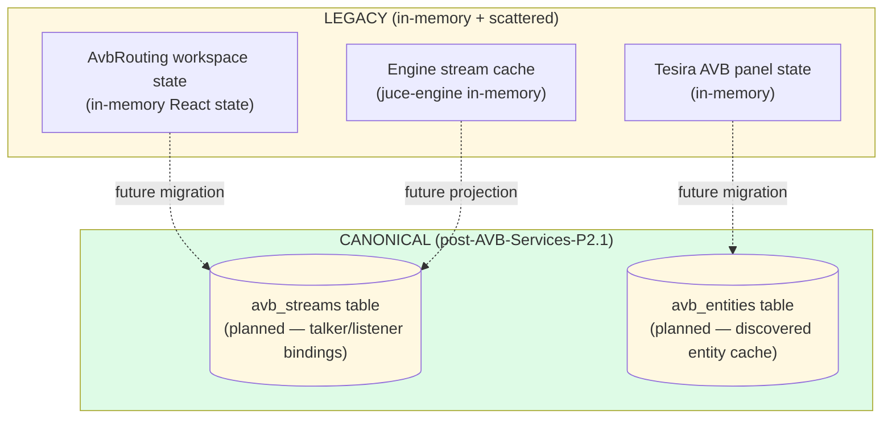
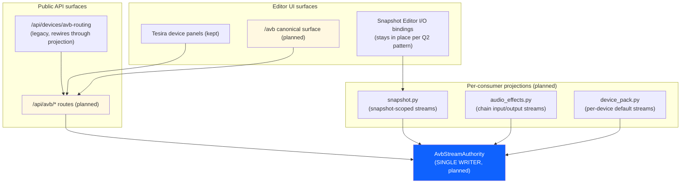
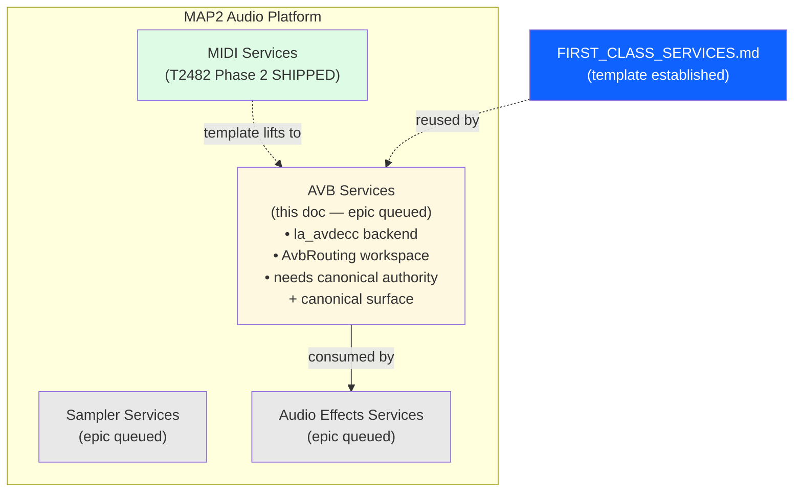

# AVB Services — first-class platform service offering (epic stub)

**Status**: Epic stub — full design + execution pending. Architecture doc + 5 architectural diagrams provided as the starting point for the future epic per the 2026-05-01 user directive.
**Template**: This doc lifts the structure from `docs/architecture/MIDI_SERVICES.md` (the reference implementation) and customizes for AVB. See `FIRST_CLASS_SERVICES.md` for the unification pattern + the 9-step process for opening a first-class-services epic.

---

## 1. The four-services framing position

AVB is one of the four first-class platform service offerings (MIDI / **AVB** / Sampler / Audio Effects). It owns audio-over-Ethernet (IEEE 1722 AVTP) — stream discovery, talker/listener binding, format negotiation, AVDECC entity model, and PTP sync.

**Today's state** (2026-05-01):
- **Backend**: `la_avdecc` v4.3.1.1 (L-Acoustics, GPLv3) integrated in the JUCE engine via `juce-engine/Source/AvdeccController.h/cpp` (`Map2AvdeccController` class). Single canonical AVDECC controller per JUCE engine instance. Observer-pattern entity discovery; async→sync bridge for stream operations.
- **Frontend**: `web/src/app/components/AvbRouting/` workspace exists with routing matrix + topology + entity inspector. Per the T2475 (MUI removal) ship report, AvbRouting still has Carbon migration debt (RoutingGrid subsystem uses MUI palette literals).
- **Tesira AVB**: Tesira device panels under `web/src/app/components/Devices/Tesira/` overlap with AVB (Tesira IS an AVB device); the AVB plane is the audio transport, the TTP plane is the control protocol — separate concerns.
- **Engine integration**: `MAP2_AVB_INTERFACE` env var sets the network interface (default `eth0`). `AVB stream config bufferSize=256` is the AVTP packet size, **not** the audio callback buffer (that's 64).

**Cross-service consumer relationship**: Audio Effects consumes AVB. An AVB input stream feeds the chain graph; chain output absorbs into an AVB output stream.

---

## 2. Unification scope (when the epic opens)

**Canonical authority**: `AvbStream` table — every AVDECC stream binding (talker entity_id + stream_id → listener entity_id + stream_id) lives here. Plus an `AvbEntity` cache for discovered entities. Provenance: `source` + `metadata.legacy_*` fields per the four-services template.

**Canonical surface**: `/avb` mount (final naming TBD). Single entry point for stream management, entity discovery, format negotiation, fault diagnosis. Old `/devices/avb-routing` redirects.

**Migration**: lift any in-memory `AvbRouting` workspace state + Tesira AVB panel state + engine-side stream cache into canonical rows.

**Inventory (preliminary)**:
- `web/src/app/components/AvbRouting/` workspace (routing matrix, patchbay, entity inspector) → absorbed into `/avb` regions
- Tesira AVB panels → reframed as device-pack-specific tools cross-linked from `/avb`
- AVDECC backend (`AvdeccController`) → wraps as the canonical authority's ingress + egress
- la_avdecc integration → unchanged (it's the IEEE 1722 protocol layer; the canonical authority sits on top)

---

## 3. Architectural diagrams (5 required views)

### 3.1 Process topology

```mermaid
flowchart LR
    subgraph host["Host process — app/ (FastAPI on :8080)"]
        avb_routes["/api/avb/* routes\n(planned — AVB Services)"]
        avb_authority["AvbStreamAuthority\n(planned — single writer)"]
        avb_projections["Per-consumer projections\n(snapshot, audio_effects,\ndevice_pack)"]
    end

    subgraph juce_engine["juce-engine (C++ audio)"]
        avdecc_controller["Map2AvdeccController\n(juce-engine/Source/AvdeccController.cpp)"]
        la_avdecc["la_avdecc v4.3.1.1\n(IEEE 1722 protocol layer)"]
        audio_callback["audio callback\n(RT thread,\nAVB streams in/out)"]
    end

    subgraph network["AVB Network (Ethernet, IEEE 1722)"]
        ptp["PTP sync\n(IEEE 802.1AS)"]
        avb_devices["AVB endpoints\n(Tesira, MOTU, QSC, etc.)"]
    end

    avb_routes -->|reads/writes| avb_authority
    avb_projections --> avb_authority
    avb_authority -.->|stream config\n(connect/disconnect/format)| avdecc_controller
    avdecc_controller --> la_avdecc
    la_avdecc <-->|IEEE 1722 + AVDECC AECP| ptp
    ptp <--> avb_devices
    la_avdecc -->|stream samples| audio_callback

    style avb_authority fill:#0f62fe,color:#fff
    style avb_routes fill:#0f62fe,color:#fff
    style avb_projections fill:#a6c8ff
    style avdecc_controller fill:#198038,color:#fff
```

### 3.2 Storage layout



(Light yellow boxes indicate planned work. The canonical tables don't exist yet — they ship as part of AVB Services Phase 2.)

### 3.3 Consumer surface



### 3.4 Migration narrative

```mermaid
flowchart LR
    subgraph today["TODAY (2026-05-01)"]
        la_avdecc_done["la_avdecc v4.3.1.1\nintegrated (2026-02-27)"]
        avb_routing_workspace["AvbRouting workspace\n(exists, partial Carbon migration)"]
        tesira_panels_done["Tesira device panels\n(exist, AVB context)"]
    end

    subgraph future_p1["AVB Services Phase 1"]
        backend_audit["Backend audit:\nstream cache + entity model"]
        canonical_design["AvbStream + AvbEntity\nschema design"]
    end

    subgraph future_p2["AVB Services Phase 2"]
        authority["AvbStreamAuthority\n+ projections"]
        migration["Migration scripts\n(in-memory state → canonical)"]
        verification["Verification suite\n(round-trip checks)"]
    end

    subgraph future_p3["AVB Services Phase 3 (frontend)"]
        canonical_surface["/avb canonical mount\n+ legacy redirects"]
        regions["Region-based IA\n(streams, entities, topology, faults)"]
    end

    subgraph future_p4["AVB Services Phase 4"]
        template_lift["Template lifted from\nFIRST_CLASS_SERVICES.md"]
        diagrams["Diagrams updated\nas implementation lands"]
    end

    la_avdecc_done --> backend_audit
    avb_routing_workspace --> canonical_design
    tesira_panels_done --> canonical_design
    backend_audit --> authority
    canonical_design --> authority
    authority --> migration
    migration --> verification
    verification --> canonical_surface
    canonical_surface --> regions
    regions --> template_lift
    template_lift --> diagrams

    style today fill:#defbe6
    style future_p1 fill:#fff8e1
    style future_p2 fill:#fff8e1
    style future_p3 fill:#e8e8e8
    style future_p4 fill:#e8e8e8
```



### 3.5 Four-services framing position



---

## 4. References

- `docs/architecture/FIRST_CLASS_SERVICES.md` — the template this doc lifts from
- `docs/architecture/MIDI_SERVICES.md` — reference implementation
- `juce-engine/Source/AvdeccController.h/cpp` — current AVDECC controller
- `~/.claude/projects/-home-mm-map2-audio/memory/MEMORY.md` — AVDECC architecture notes
- AVB-side state notes in CLAUDE.md (AVB buffer size = 256 = AVTP packet size, NOT audio callback)
