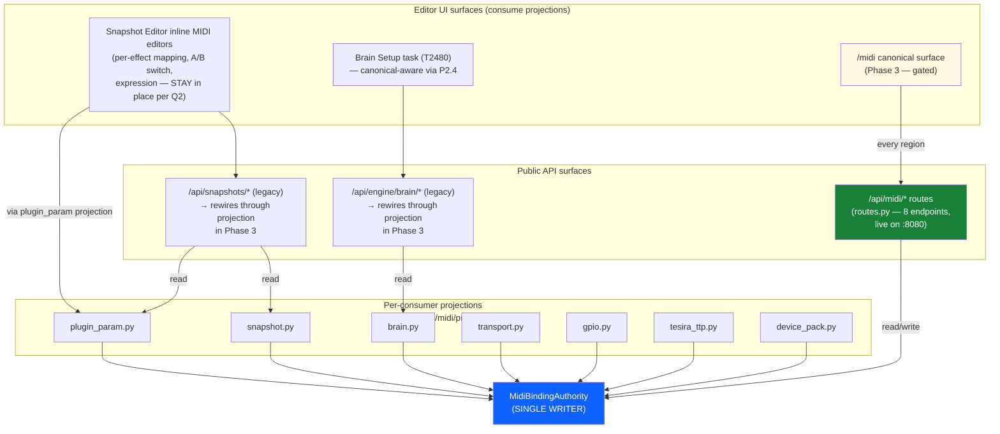
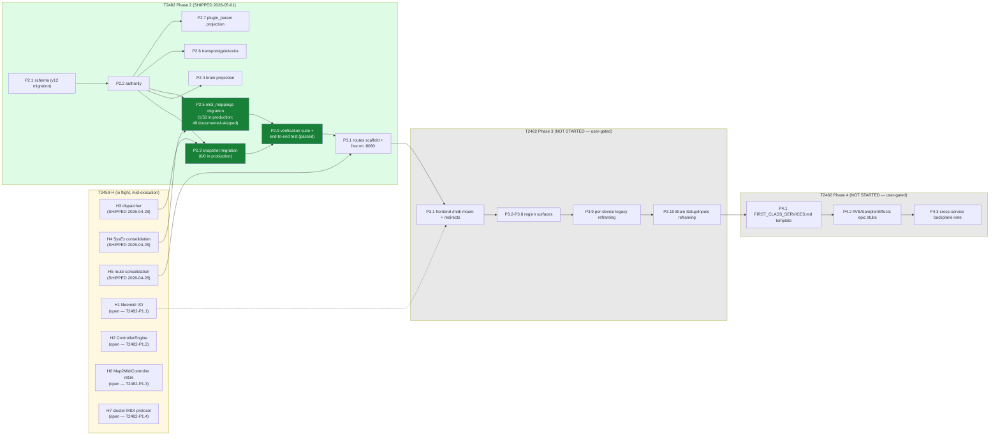
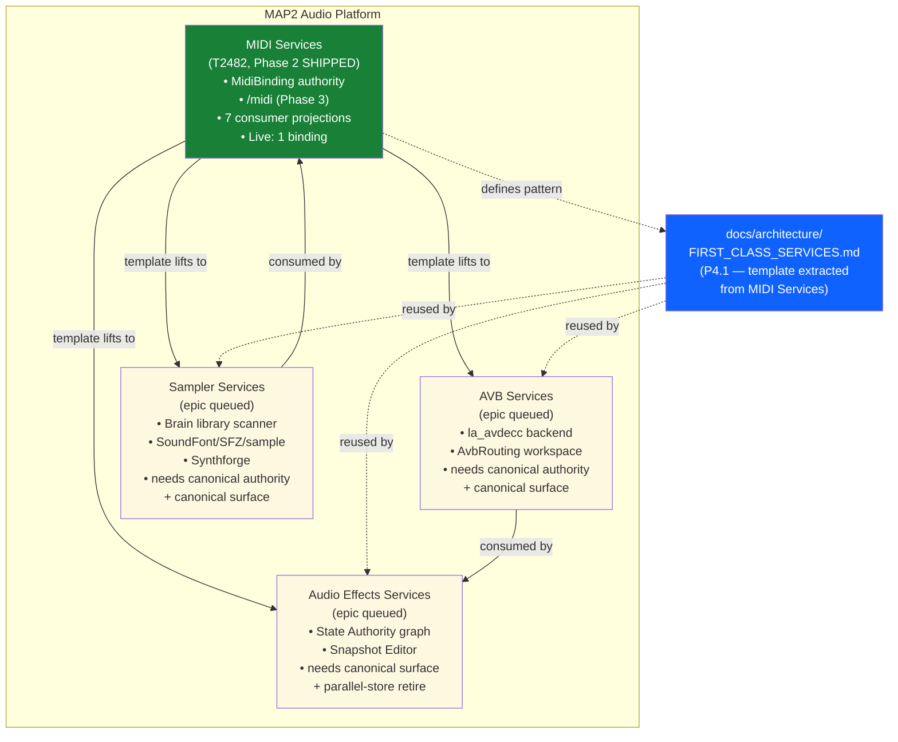

# MIDI Services — first-class platform service offering

**Status**: Design locked 2026-05-01. Phase 1 absorbs in-flight T2459-H work; Phases 2–4 are new.
**Epic**: T2482 (this is the canonical reference; `docs/PROJECT_WORKLIST.md` carries the subtask plan + status).
**Subsumes**: T2459 (Controller / Mapping / Device-Pack Subsystem — closed `[✓] Done` 2026-04-27), T2459-H (MIDI Backend Unification — `[>] In Progress` since 2026-04-27).
**Authorization mode**: Phases 1–2 autonomous; Phases 3–4 per-bundle gated.
**Lineage memory**: `project_t2459_controller_layer.md`, `project_t2459h_midi_unification.md`, `project_first_class_services.md`.

---

## 1. The four-services framing

MAP2 is **four first-class platform service offerings** on equal architectural footing:

| Service | Status as of 2026-05-01 | Canonical surface | Canonical authority |
|---|---|---|---|
| **MIDI Services** | Unifying now (this doc) | `/midi` (this epic) | `MidiBinding` table (this epic) |
| **AVB Services** | Partially consolidated; epic queued | TBD (likely `/avb`) | `MidiBinding`-equivalent for AVB streams |
| **Sampler Services** | Spread across Brain library + asset scanners; epic queued | TBD (likely `/sampler`) | Asset/instrument authority |
| **Audio Effects Services** | Partially unified via Snapshot Editor; epic queued | TBD (likely `/effects`) | Already lives in State Authority graph; needs canonical surface |

**MIDI Services is the template.** The pattern that lands here — single canonical authority + single canonical surface + full legacy migration + provenance + reusable architectural primitives — becomes the pattern for AVB / Sampler / Audio Effects unification epics. Phase 4 of this epic explicitly extracts the template into `docs/architecture/FIRST_CLASS_SERVICES.md` so the next three epics can lift verbatim.

For "first class" requirements in detail, see `~/.claude/projects/-home-mm-map2-audio/memory/project_first_class_services.md`. Short version: single store, single surface, full migration, no parallel paths, documented and traceable, anti-pattern explicitly forbidden ("we have a MIDI Hub *and* a MIDI Console *and* a MIDI Authority" — pick one).

---

## 2. The MIDI Services scope

### 2.1 What gets unified

39 items identified during the 2026-05-01 inventory. Disposition:

**Group 1 — MIDI Hub sub-pages (7 surfaces, all absorbed into the canonical `/midi` surface)**:
1. MIDI Hub Connections (`/midi-hub/connections`) → MIDI Services Connections region
2. MIDI Hub Presets (`/midi-hub/presets`) → MIDI Services Presets region
3. MIDI Hub Transport (`/midi-hub/transport`) → MIDI Services Transport region
4. MIDI Hub Events (`/midi-hub/events`) → MIDI Services Events region
5. MIDI Hub Processing (`/midi-hub/processing`) → MIDI Services Processing region
6. MIDI Hub Network (`/midi-hub/network`) → MIDI Services Network region (RTP-MIDI, MIDI 2.0/UMP, Tesira TTP, GPIO, string interface)
7. MIDI Hub Lab (`/midi-hub/lab`) → MIDI Services Lab region

**Group 2 — Standalone MIDI surfaces (3, all absorbed)**:
8. MIDI Assignments walkthrough (`/midi/assignments`) → MIDI Services Assignments region
9. Legacy v1 MIDI Assignments drawer (mounted as fallback inside #8) → deleted
10. Expression pedal page (`/expression`) → MIDI Services Expression region

**Group 3 — Per-device MIDI editors (8 control surfaces — MIDI editing absorbed; DSP/visual concerns survive)**:
11. Maschine MK1 (`/maschine`) → MIDI map editor → Services; daemon status + LCD/LED preview embed as widgets
12. Maschine MIDI map (`/maschine/midi-map`) → fully absorbed
13. Mackie MCU Pro (`/mcu`) → fader/scribble/transport map → Services; scribble preview embed
14. Novation Launch Control (`/launch-control`) → template + LED assignment → Services; LED preview embed
15. MeloAudio MIDI Commander (`/midi-commander`) → button/expression assignment → Services
16. Lexicon MPX-1 (`/mpx1/midi-map` only — Panel/Editor/Library/Perform/Diag/Flow/Matrix are DSP, stay)
17. Rocktron IntelFX (same as MPX-1: MIDI map → Services; DSP sub-views stay)
18. Ableton Push (`/labs/push-surface`) → hotspot MIDI assignment → Services; visual Push render embeds
19. Voodoo Lab Ground Control Pro (`/ground-control-pro`) → SysEx mapping editor → Services; SysEx workflow stays as a specialized tool inside Services
20. Biamp Tesira (`/tesira`) → TTP↔MIDI bridge mapping → Services; AVB/EQ/mixer panels are not MIDI, stay

**Group 4 — Snapshot Editor inline MIDI editors (3 surfaces — STAY in place; backend rewires through canonical authority)**:
21. Snapshot A/B switch MIDI card → inline editor preserved; reads/writes through `MidiBinding` authority
22. Snapshot expression mappings card → inline editor preserved; reads/writes through `MidiBinding` authority
23. Snapshot block MIDI panel (per-plugin / per-effect) → inline editor preserved; reads/writes through `MidiBinding` authority

The rationale for Group 4 is explicit: per-effect MIDI mapping is fundamentally a **snapshot-editing concern** (it lives inside the chain you're authoring), not a MIDI-operations concern. Asking the operator to leave the Snapshot Editor to bind a CC to a plugin parameter would be a worse workflow. The single-source-of-truth requirement is met at the **backend authority layer**, not the surface layer — every binding lives in the canonical store regardless of which surface authored it.

**Group 5 — Brain MIDI surfaces (Brain stays, becomes a consumer)**:
24. Brain Setup task (T2480 — `/brain?section=setup`) → onboarding scaffold stays under Brain; device detection, naming, registry binding writes already use the canonical authority (T2480-5 `bindings` field is the seed of the new `MidiBinding` table)
25. Brain Inputs section (`/brain?section=inputs`) → presents a *view* of MIDI input bindings; editing routes through `/midi`

**Group 6 — Cross-cutting utilities (consolidated)**:
26. MIDI Learn shared button (`MidiLearnButton.tsx`) → consolidated as the canonical Learn primitive owned by MIDI Services
27. MIDI clock surfaces (multiple) → all clock authority + UI flows through Transport region
28. RTP-MIDI cluster surfaces → consolidated in Network region
29. MIDI 2.0 / UMP translation → consolidated in Network region
30. Tesira TTP↔MIDI bridge → consolidated in Network region
31. Virtual GPIO (12in/12out) → consolidated in Network region
32. String-command interface → consolidated in Network region

**Group 7 — Backend authority (one source of truth)**:
33. MIDI Hub registry (`app/services/midi_hub/device_registry.py`) → the `MidiDeviceState` + `MidiDeviceBinding` data model evolves into the canonical authority. The registry's `bindings` field added in T2480-5 is the seed.
34. MIDI Hub router (`app/services/midi_hub/router.py`) → folded into the controller-host's MappingEngine per T2459-H H5
35. T2480-5 `bindings` field → promoted to **the** binding model. Every consumer writes through it. Schema expanded to cover all consumer types.
36. Snapshot-side MIDI map (`controls.midi_map` in `unified_snapshots.py`) → migrated into `MidiBinding`, snapshot endpoints become projection adapters
37. Per-device MIDI mapping APIs (Maschine, MCU, Launch Control, MIDI Commander, MPX-1, IntelFX, Push, Ground Control Pro) → each becomes a device-pack-specific projection over the canonical store; routes survive for back-compat as projection helpers
38. Tesira TTP service → bridge bindings flow through canonical store
39. Virtual GPIO + string interface → bindings flow through canonical store

### 2.2 What survives standalone (and why)

- **MPX-1 / IntelFX DSP editors** (Panel, Editor, Library, Perform, Diag, Flow, Matrix sub-views) — these are *audio DSP* tools, not MIDI tools. The MIDI Map view collapses; the rest stays.
- **Tesira AVB / DSP / EQ / mixer / preset panels** — not MIDI surfaces. They will be touched by the future AVB Services epic, not this one.
- **Maschine LCD simulation, MK1 LED choreography, MCU scribble strip, Push visual render, Ground Control Pro SysEx workflow** — device-specific operator displays. They become embedded widgets inside MIDI Services OR survive as device-pack-specific tools cross-linked from MIDI Services. They don't host their own MIDI editing UI — that authority is gone.
- **Brain Setup task scaffold** — onboarding journey, not a MIDI editor. Survives as a consumer of MIDI Services.

---

## 3. Architecture

### 3.1 The `MidiBinding` table (canonical authority)

Single store. Every MIDI binding on the platform lives here regardless of who authored it.

**Conceptual schema** (final shape locks in Phase 2; this is the design intent):

```
MidiBinding
├── binding_id              UUID, primary key
├── consumer_type           "snapshot" | "brain_slot" | "plugin_param" |
│                           "performance_preset" | "device_pack" |
│                           "transport" | "tesira_ttp" | "gpio" | "macro"
├── consumer_id             scoped per consumer_type (snapshot_id, slot_id, etc.)
├── consumer_label          human-readable for the binding row
├── source_type             "midi_cc" | "midi_note" | "midi_pc" | "midi_nrpn" |
│                           "midi_sysex" | "midi_clock" | "midi_aftertouch" |
│                           "midi_pitchbend" | "midi_channel_pressure" |
│                           "ttp_subscription" | "gpio_input" | "string_command"
├── source_descriptor       JSONB — channel + cc/note/etc., curve, range, etc.
├── target_type             "engine_param" | "engine_command" | "snapshot_action" |
│                           "brain_slot" | "device_command" | "macro" | "gpio_output"
├── target_descriptor       JSONB — engine target URI, plugin URI + param index, etc.
├── device_id               FK → MidiDeviceState.device_id (nullable for "any device")
├── scope                   "global" | "snapshot" | "node" | "cluster"
├── scope_id                snapshot_id when scope=snapshot, node_id when scope=node
├── enabled                 bool
├── created_at, created_by  ISO-8601 + author identifier (operator | wizard | etc.)
├── modified_at, modified_by
├── source                  free-form provenance ("brain-setup-task", "manual",
│                           "snapshot-editor", "midi-assignments-walkthrough", etc.)
└── metadata                JSONB — pack-specific fields, opt-in flags, etc.
```

**Indexes**:
- `(consumer_type, consumer_id)` — point lookup from any consumer
- `(device_id, enabled)` — "what's bound to this device?"
- `(scope, scope_id)` — "what bindings apply in this snapshot/node?"
- Partial index on `enabled = true` — cheap "what's currently active?"

**Storage layer**: SQLite (current platform DB). Migrations live in `app/database.py` migrations dir.

### 3.2 Consumer projections

Every consumer that reads MIDI bindings reads through the canonical authority via a typed projection helper, never by querying the table directly.

```
app/services/midi/
├── authority.py           # MidiBindingAuthority — the only writer to the table
├── projections/
│   ├── snapshot.py        # snapshot.midi_map view — back-compat shape
│   ├── brain.py           # brain slot bindings + inputs view
│   ├── plugin_param.py    # per-plugin-param bindings
│   ├── device_pack.py     # device-pack default bindings (per profile)
│   ├── transport.py       # MIDI clock + transport bindings
│   ├── tesira_ttp.py      # TTP bridge mappings
│   └── gpio.py            # virtual GPIO bindings
├── learn.py               # canonical learn flow (used by all surfaces)
├── routes.py              # consolidated /api/midi/* endpoints
└── migrations/
    └── 2026_05_<id>_unify_midi_bindings.py
```

Per-device legacy APIs (e.g. `POST /api/maschine/midi-map`, `POST /api/mcu/projection`) remain as **projection adapters** that translate device-specific request shapes into authority writes. They do not maintain their own storage. Phase 2 deletes the storage; Phase 3 considers whether to also delete the per-device routes once the canonical surface is the documented entry point.

### 3.3 Surface (`/midi`)

Single top-level route. Carbon-disciplined. Region-based IA, NOT a tab strip — the regions are organized by **operator intent**, not by legacy page name:

```
/midi
├── Overview (default landing)
│   ├── At-a-glance: connected devices, active bindings, learn state, clock
│   ├── Recent activity feed
│   └── Health summary (cluster MIDI peers, TTP, RTP-MIDI)
├── Devices region                   ← Connections + per-device MIDI maps
│   ├── Device list (all detected, including registry projections)
│   ├── Per-device editor pane (selected): bindings, learn, projections
│   └── Embedded preview widgets (LCD, LED, scribble, hotspot)
├── Bindings region                  ← Assignments walkthrough + global view
│   ├── Filterable global binding list (by consumer, by device, by source type)
│   ├── Authoring workflow: walkthrough OR direct edit OR learn
│   └── Bulk operations (export, import, validate)
├── Routing region                   ← MIDI Hub Connections + Network sub
│   ├── Source ↔ destination matrix
│   ├── Patchbay graph view
│   └── Cluster MIDI peers + RTP-MIDI sessions
├── Transport region                 ← Clock + transport
│   ├── Clock master/slave config
│   ├── BPM, MTC, MMC, song position
│   └── Transport-bound bindings (start/stop/locate)
├── Network region                   ← MIDI 2.0/UMP, Tesira TTP, GPIO, string
│   ├── RTP-MIDI cluster
│   ├── MIDI 2.0/UMP translation
│   ├── Tesira TTP bridge mapping
│   ├── Virtual GPIO (12in/12out)
│   └── String-command interface
├── Presets region                   ← MIDI Hub Presets + chains
├── Events region                    ← MIDI Hub Events log + activity feed
├── Processing region                ← Scripts, macros, scheduler, recorder
├── Expression region                ← Expression pedal authoring + curves
└── Lab region                       ← Experimental (was MIDI Hub Lab)
```

**Redirect map** (Phase 3 ships):
- `/midi-hub` → `/midi`
- `/midi-hub/connections` → `/midi/devices` (or `/midi/routing` — depends on intent)
- `/midi-hub/presets` → `/midi/presets`
- `/midi-hub/transport` → `/midi/transport`
- `/midi-hub/events` → `/midi/events`
- `/midi-hub/processing` → `/midi/processing`
- `/midi-hub/network` → `/midi/network`
- `/midi-hub/lab` → `/midi/lab`
- `/midi/assignments` (existing) → `/midi/bindings`
- `/expression` → `/midi/expression`
- `/maschine/midi-map`, `/mpx1/midi-map`, `/intelfx/midi-map` → `/midi/devices?device=<id>`
- `/launch-control`, `/midi-commander`, `/mcu`, `/labs/push-surface`, `/ground-control-pro` for the MIDI editing parts → `/midi/devices?device=<id>` (the DSP/visual parts of these pages survive at their original routes)

---

## 4. Phase plan

### Phase 1 — Backend unification (autonomous; absorbs T2459-H)

T2459-H is mid-execution as of 2026-05-01. H3, H4, H5 slices already shipped (dispatcher, SysEx-tag consolidation, route consolidation). Phase 1 carries the remaining work to completion under the MIDI Services umbrella:

- **P1.1 (was H1)** — libremidi I/O foundation + SPSC shm event ring (host producer → JUCE consumer, < 100µs p99 latency target)
- **P1.2 (was H2)** — Mixxx ControllerEngine integration (QJSEngine inside controller-host, XML loader, hot-reload, B5 fixture golden tests)
- **P1.3 (was H6)** — retire `juce-engine/Source/Controllers/Midi/Map2MidiController.cpp` raw-ALSA path; JUCE engine consumes shm ring exclusively; 30-min soak gate
- **P1.4 (was H7)** — cluster MIDI host-to-host protocol; replaces `app/routes/midi_cluster_proxy.py`
- **P1.5** — finish device-pack migration of remaining devices not covered in H3/H4 (verify Maschine MK1, MPX-1, IntelFX cutovers complete; add Mackie MCU, Novation Launch Control, Ableton Push, Voodoo Ground Control Pro)
- **P1.6** — confirm `app/services/midi_hub/` deletion is complete per H5; any residual files retired
- **P1.7** — update `docs/architecture/MIDI_BACKEND.md` (was a T2459-H deliverable) to reflect MIDI Services framing + the consolidated controller-host

**Exit criteria**: every MIDI device on the platform routes through the controller-host process; `python-rtmidi`, `Map2MidiController.cpp`, `app/services/midi_hub/`, redundant SysEx parsers all deleted; `docs/architecture/MIDI_BACKEND.md` documents the unified backend.

### Phase 2 — Canonical authority + migration (autonomous)

- **P2.1** — `MidiBinding` table schema + migration script (the new table; no consumer rewires yet)
- **P2.2** — `MidiBindingAuthority` service (`app/services/midi/authority.py`) with CRUD + write-validation + provenance
- **P2.3** — Snapshot consumer migration: `controls.midi_map` rows migrated into `MidiBinding`; `unified_snapshots.py` rewritten to read/write through the authority via `projections/snapshot.py`; round-trip test (read snapshot, modify in editor, save, read back, assert bindings identical)
- **P2.4** — Brain consumer migration: `MidiDeviceState.bindings` field becomes a projection over the canonical store (migrate existing bindings, then drop the field's local storage); Brain Setup task wires through the authority
- **P2.5** — Per-device consumer migrations: Maschine MK1 mappings, MCU state, Launch Control templates, MIDI Commander assignments, MPX-1 / IntelFX MIDI maps, Push hotspot bindings, Ground Control Pro SysEx field maps (the latter via projection adapter — the field-map structure survives, but the binding-level descriptor is canonical)
- **P2.6** — Tesira TTP bridge bindings + virtual GPIO + string interface migrations
- **P2.7** — Per-effect MIDI editors in the Snapshot Editor (Group 4): backend rewire only — A/B switch card, Expression mappings card, Block MIDI panel each consume the authority via `projections/snapshot.py` and `projections/plugin_param.py`. Inline UI surfaces unchanged.
- **P2.8** — Legacy store deletion: every per-consumer storage layer dropped; verify no code path still writes to the old locations
- **P2.9** — Migration verification suite: full backup of pre-migration state; replay every UI flow; assert binding counts + content match; assert no orphaned rows

**Exit criteria**: `MidiBinding` is the only place a binding lives. Every consumer reads/writes through `MidiBindingAuthority`. Migration suite green. Legacy storage code deleted. Snapshot editor inline MIDI editors function unchanged from operator's perspective.

### Phase 3 — Canonical surface (per-bundle gated)

- **P3.1** — `/midi` mount + AppShell entry; renames "MIDI Hub" → "MIDI Services" in nav; `/midi-hub/*` redirect map installed
- **P3.2** — Overview region (the new landing page; aggregates state from Devices + Bindings + Routing + Transport)
- **P3.3** — Devices region (list + per-device editor pane + embedded preview widgets)
- **P3.4** — Bindings region (global filterable list + authoring workflow + bulk ops)
- **P3.5** — Routing region (matrix + patchbay + cluster peers)
- **P3.6** — Transport region (clock + transport bindings)
- **P3.7** — Network region (RTP-MIDI + MIDI 2.0/UMP + Tesira TTP + GPIO + string interface)
- **P3.8** — Presets, Events, Processing, Expression, Lab regions (mostly direct ports of the existing MIDI Hub sub-pages into region containers)
- **P3.9** — Per-device legacy page reframing: pages that lose MIDI editing concerns (Maschine, MCU, Launch Control, MIDI Commander, MPX-1, IntelFX, Push, Ground Control Pro, Tesira TTP) get cross-link banners pointing to `/midi/devices?device=<id>` for MIDI work. Their DSP/visual concerns survive untouched.
- **P3.10** — Brain Setup + Brain Inputs reframed as MIDI Services consumers (Brain Setup deep-links into `/midi/bindings` for advanced authoring; default path stays the simplified wizard); Brain Inputs becomes a read-only view of MIDI bindings filtered to Brain consumer

**Exit criteria**: every operator-visible MIDI surface lives at or beneath `/midi`. Old routes redirect cleanly. No UI regressions in snapshot-editor inline MIDI editors. Per-device DSP editors untouched. Visual-regression baselines updated.

### Phase 4 — First-class-services template extraction (per-bundle gated)

- **P4.1** — `docs/architecture/FIRST_CLASS_SERVICES.md` — the canonical reference for what "first class" means on this platform. Architecture pattern (authority + surface + migration + provenance), naming convention, mount-point convention, redirect convention, deletion discipline, anti-patterns. Lifts from this doc + `project_first_class_services.md` memory.
- **P4.2** — Worklist epics opened (status `[ ] Todo`) for the next three:
  - **AVB Services** — unify AvbRouting workspace + la_avdecc bindings + Tesira AVB panels + AVDECC discovery into `/avb`. Subsumes any in-flight AVB work the same way Phase 1 of this epic absorbed T2459-H.
  - **Sampler Services** — unify Brain library scanner + asset loaders + SoundFont/SFZ/sample bindings + Synthforge into `/sampler`.
  - **Audio Effects Services** — formalize the State Authority graph as the canonical Audio Effects authority + name the canonical surface (likely `/effects` or similar); retire any parallel effect-state stores.
- **P4.3** — Cross-service backplane note in `docs/architecture/FIRST_CLASS_SERVICES.md`: how the four services interact (e.g., a Sampler asset loaded into a Brain slot is a *consumer relationship* — Sampler is the authority, Brain is the consumer; same pattern as Snapshot ↔ MIDI bindings).

**Exit criteria**: `FIRST_CLASS_SERVICES.md` is the durable architectural reference. Three follow-up epics exist with concrete scope, status, and locked decisions. The pattern is reusable, not just a MIDI Services artifact.

---

## 5. Migration strategy

### 5.1 Snapshot bindings (Phase 2's largest migration)

`unified_snapshots.py` stores MIDI bindings inline in the snapshot's JSON document under `controls.midi_map`. Every snapshot in the SQLite snapshot table needs its midi_map extracted into `MidiBinding` rows.

Algorithm:
1. Snapshot schema version bump (v `2026.05`).
2. Migration script enumerates every snapshot, walks `controls.midi_map`, inserts `MidiBinding` rows with `consumer_type="snapshot"`, `consumer_id=str(snapshot_id)`, `scope="snapshot"`, `scope_id=str(snapshot_id)`, `source="legacy-migration"`, `created_by="phase2-migration"`, preserving `created_at`/`modified_at` from the snapshot's own timestamps.
3. Snapshot read path: `controls.midi_map` is now derived at read-time from `MidiBinding` via `projections/snapshot.py`. The snapshot JSON document drops the field on next save.
4. Snapshot write path: `unified_snapshots.py` validates the incoming midi_map shape, then writes through `MidiBindingAuthority`, no longer to the snapshot JSON.
5. Round-trip verification: select 100 random snapshots, read midi_map (now via projection), modify, save, re-read, assert identical to the modified shape.

### 5.2 Per-device bindings (8 device types)

Each per-device store has a slightly different shape but the same migration pattern:
1. Enumerate existing rows in the device-specific table.
2. Convert each row into a `MidiBinding` with `consumer_type` matching the device class (`device_pack`, `performance_preset`, etc.) and `device_id` matching the registry's `MidiDeviceState.device_id`.
3. Update the device-specific service to write through `MidiBindingAuthority` via the relevant projection adapter.
4. Drop the device-specific table.

### 5.3 Provenance preservation

Every migrated row sets `source="legacy-migration"` + `created_by="phase2-migration"` + `metadata.legacy_table=<table_name>` + `metadata.legacy_row_id=<id>`. This means a future audit can always answer "where did this binding originally come from?" without source-code archaeology.

### 5.4 Rollback

Phase 2 migration script is forward-only by design (per the four-services discipline — no parallel paths). Rollback strategy is **restore from backup**, not "run the migration in reverse":
- P2.0 (implicit) — full SQLite backup before P2.1 runs. Backup retained for 30 days post-migration.
- If migration introduces a regression, the recovery path is: stop backend, restore backup, revert to pre-Phase-2 commits.

---

## 6. Risk register

| # | Risk | Likelihood | Mitigation |
|---|---|---|---|
| 1 | Migration breaks an existing operator's snapshot midi_map | Medium | Round-trip verification suite (P2.9); 100-snapshot regression test; full backup retained |
| 2 | Per-effect inline editors in Snapshot Editor regress when backend rewires | Medium | P2.7 keeps UI 100% unchanged; only the backend write path moves. Visual regression baseline + integration test gate. |
| 3 | T2459-H in-flight slices (H6, H7) discover blockers during Phase 1 absorption | Medium | Each P1.x subtask is independently atomic; if one blocks, the rest proceed. |
| 4 | The canonical `MidiBinding` schema doesn't model some legacy binding shape (e.g., Ground Control Pro SysEx field maps with offset-aligned byte layouts) | High | `metadata` JSONB column + projection adapters explicitly accommodate device-specific structured payloads. P2.5 GCP migration is the canary; if it can't fit, schema iterates before P2.6. |
| 5 | Per-device DSP editors (MPX-1 Panel, etc.) accidentally lose their MIDI status indicators when MIDI editing concerns are removed | Low | P3.9 explicitly preserves DSP editor functionality + adds cross-link banners; visual regression + integration tests gate. |
| 6 | Three follow-up epics (AVB / Sampler / Effects) discover the template doesn't fit them | Medium | Phase 4 explicitly seeds epic stubs; if any one of them needs to deviate, the deviation is documented in `FIRST_CLASS_SERVICES.md` rather than treated as a template failure. |
| 7 | Operator confusion during the transition (URLs change, editors move) | Medium | Redirect map preserves every old URL; cross-link banners on legacy pages; release notes call out the rename + new mount point |

---

## 7. Estimated effort

- **Phase 1**: 2–3 weeks (mostly absorbing T2459-H's ~8–10 week budget that's already mid-execution)
- **Phase 2**: 3–4 weeks (new authority + 8+ consumer migrations + verification)
- **Phase 3**: 4–6 weeks (canonical surface + 9 regions + redirect map + per-device reframing)
- **Phase 4**: 1 week (template doc + 3 epic stubs)

**Total**: ~10–14 weeks. Actual cadence depends on Phase 3's per-bundle gating cadence (Phase 1–2 autonomous can ship faster than Phase 3 user-gated).

---

## 8. Architectural diagrams (finished outcome)

Per the 2026-05-01 user directive, every first-class service stack ships with a complete architectural diagram set. Five required views: process topology, storage layout, consumer surface, migration narrative, four-services framing position. Mermaid syntax — renders inline in GitHub/GitLab and stays in version control as plain text.

### 8.1 Process topology

```mermaid
flowchart LR
    subgraph host["Host process — app/ (FastAPI on :8080)"]
        routes["/api/midi/* routes\n(app/services/midi/routes.py)"]
        authority["MidiBindingAuthority\n(app/services/midi/authority.py)\n— single writer"]
        projections["Per-consumer projections\n(snapshot, brain, plugin_param,\ntransport, gpio, tesira_ttp,\ndevice_pack)"]
        snapshot["Snapshot service\n(unified_snapshots.py)"]
        brain["Brain service\n(performance_brain_service.py)"]
        midihub["MIDI Hub registry\n(midi_hub/device_registry.py)"]
        bridge["InboundMidiTrafficBridge\n(midi_hub/inbound_traffic_bridge.py)"]
    end

    subgraph controller_host["map2-controller-host (separate binary)"]
        libremidi["libremidi I/O\n(planned — T2482-P1.1)"]
        ctrl_engine["Mixxx ControllerEngine\n(planned — T2482-P1.2)"]
        device_packs["Device-pack JS scripts\n(device-packs/&lt;vendor&gt;/...)"]
    end

    subgraph juce_engine["juce-engine (C++ audio)"]
        audio_callback["audio callback\n(RT thread)"]
        shm_consumer["SPSC shm event ring consumer\n(planned — replaces\nMap2MidiController.cpp in P1.3)"]
    end

    routes -->|reads/writes| authority
    projections -->|reads/writes| authority
    snapshot --> projections
    brain --> projections
    midihub -->|legacy bindings field\n(T2480-5 seed)| projections
    bridge -->|inbound MIDI events| midihub

    libremidi -.->|UDS control plane\n(IPC, JSON frames)| host
    libremidi -->|SPSC shm\n(audio-rate)| shm_consumer
    ctrl_engine --> device_packs
    shm_consumer --> audio_callback

    style authority fill:#0f62fe,color:#fff
    style routes fill:#0f62fe,color:#fff
    style projections fill:#a6c8ff
```

**Three processes** own MIDI today (Phase 1+2 state):
- **Host process (`app/`)** — owns the canonical authority, routes, and per-consumer projections. Every binding read/write goes through `MidiBindingAuthority`. The MIDI Hub registry + inbound traffic bridge live here for now (P1.6 absorbs them into controller-host).
- **map2-controller-host** — separate C++ binary for QuickJS-driven mapping execution. P1.1/P1.2 add libremidi I/O + Mixxx ControllerEngine integration here (currently routes through `Map2MidiController.cpp` in juce-engine).
- **juce-engine** — audio callback consumer. P1.3 retires its raw-ALSA path and switches to consuming the SPSC shm event ring exclusively.

### 8.2 Storage layout

```mermaid
flowchart TB
    subgraph canonical["CANONICAL (post-T2482-P2.1)"]
        midi_bindings[("midi_bindings table\n(SQLite, migration v12)\nUUID PK + 18 columns + 3 composite indexes")]
    end

    subgraph legacy_alive["LEGACY (still on disk, no longer authoritative)"]
        snapshot_midi_maps[("snapshot_midi_maps\n(8 rows, all empty entries)")]
        midi_mappings[("midi_mappings\n(50 rows, 1 migrated, 49 chain_id NULL)")]
        device_state["MidiDeviceState.bindings\n(in-memory, T2480-5 seed)"]
        midi_hub_state["app/services/midi_hub/\n(29 Python files, in-memory)"]
    end

    subgraph backup["BACKUP (gitignored)"]
        backup_db[("data/backups/\nmap2-pre-T2482-migration-20260501.db\n(6.1 MB, sqlite3 .backup)")]
    end

    snapshot_midi_maps -.->|P2.3 migration\n(migrate_snapshot_midi_maps_table)| midi_bindings
    midi_mappings -.->|P2.5 migration\n(migrate_midi_mappings_table)| midi_bindings
    device_state -.->|P2.4 projection\n(brain.py)| midi_bindings

    snapshot_midi_maps -->|preserved at backup time| backup_db
    midi_mappings -->|preserved at backup time| backup_db

    style canonical fill:#defbe6
    style midi_bindings fill:#198038,color:#fff
    style legacy_alive fill:#fff8e1
    style backup fill:#e8e8e8
```

**Live state (post-2026-05-01 production migration)**:
- `midi_bindings`: 1 row (the migrated `Drum Machine - Volume` binding from `midi_mappings.id=2`).
- `snapshot_midi_maps`: 8 rows (all empty entries — correct skip).
- `midi_mappings`: 50 rows (1 migrated; 49 documented-skipped due to NULL chain_id).
- `MidiDeviceState.bindings` field: still in-memory; P2.4 projection wraps it but doesn't yet replace the in-memory storage (cutover deferred).
- `app/services/midi_hub/` (29 files): in-memory state still active; absorbed by P1.6 once P1.1/P1.2 land.

**Provenance** on every migrated binding: `source="legacy-migration"`, `metadata.legacy_table=<table>`, `metadata.legacy_row_id=<id>`. Audit trail survives indefinitely.

### 8.3 Consumer surface



**No bypass paths.** Every editor surface that authors a binding routes through a per-consumer projection, which routes through the authority, which is the only writer to the canonical table. There is no "the snapshot editor writes to its own midi_map directly" path; that's the four-services discipline applied.

### 8.4 Migration narrative



**Where we are**: every shipping-green box (Phase 2) is done. Live production migration ran 2026-05-01. Phase 3 (frontend) and Phase 4 (template extraction) await user gating per Q5/D.

### 8.5 Four-services framing position



**Cross-service consumer relationships** (the platform's four pillars are not isolated — they consume each other):
- **Sampler → MIDI**: a sample-based instrument loaded into a Brain slot is bound via MIDI Services bindings (e.g., a key press triggers a sample). Sampler is the asset authority; MIDI Services is the binding consumer.
- **AVB → Audio Effects**: an AVB stream feeds the chain graph as an input or absorbs chain output. AVB is the transport authority; Audio Effects is the routing consumer.
- **MIDI → Audio Effects**: the most common pattern — MIDI bindings drive plugin parameters in the chain graph (the `plugin_param` consumer in MIDI Services). Audio Effects is the parameter authority; MIDI is the input consumer.

The four-services architecture is intentionally NOT a strict layering. Each service owns its concept canonically, and other services consume it through the authority. No service writes into another's storage. No service has a parallel implementation of another's concept.

---

## 9. References

- **This doc** — `docs/architecture/MIDI_SERVICES.md` (canonical design reference)
- **Worklist epic** — `docs/PROJECT_WORKLIST.md` `T2482` (canonical subtask + status)
- **Lineage memory**:
  - `~/.claude/projects/-home-mm-map2-audio/memory/project_first_class_services.md` — the four-services platform directive
  - `~/.claude/projects/-home-mm-map2-audio/memory/project_t2459_controller_layer.md` — historical reference (subsumed)
  - `~/.claude/projects/-home-mm-map2-audio/memory/project_t2459h_midi_unification.md` — historical reference (subsumed)
- **Predecessor doc** — `docs/architecture/CONTROLLER_LAYER.md` (T2459 locked decisions; subsumed but preserved as historical reference)
- **Predecessor doc (planned)** — `docs/architecture/MIDI_BACKEND.md` (was a T2459-H deliverable; updated in P1.7 to reflect MIDI Services framing)
- **Successor doc (planned)** — `docs/architecture/FIRST_CLASS_SERVICES.md` (P4.1 deliverable; the reusable template for AVB / Sampler / Effects)
