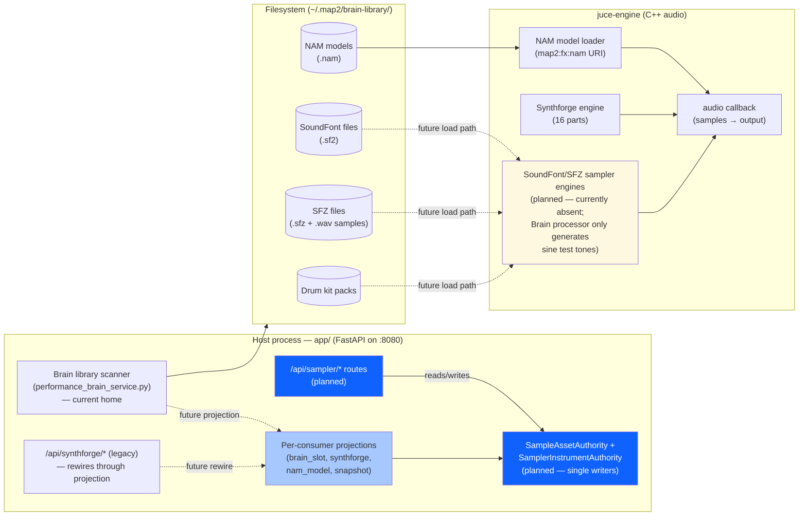
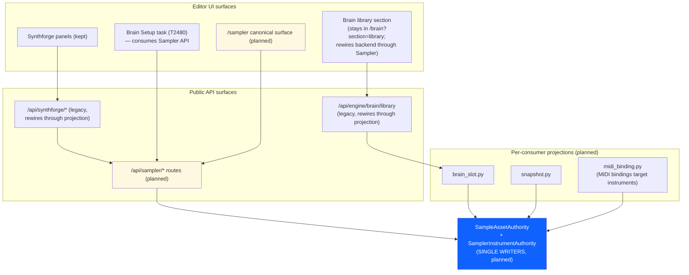
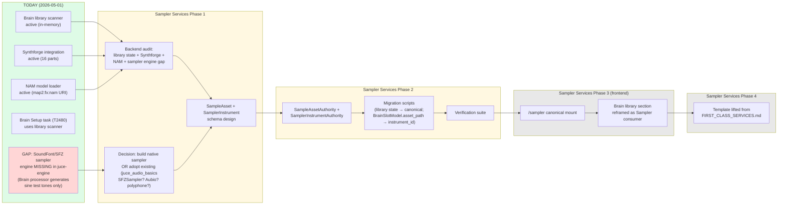
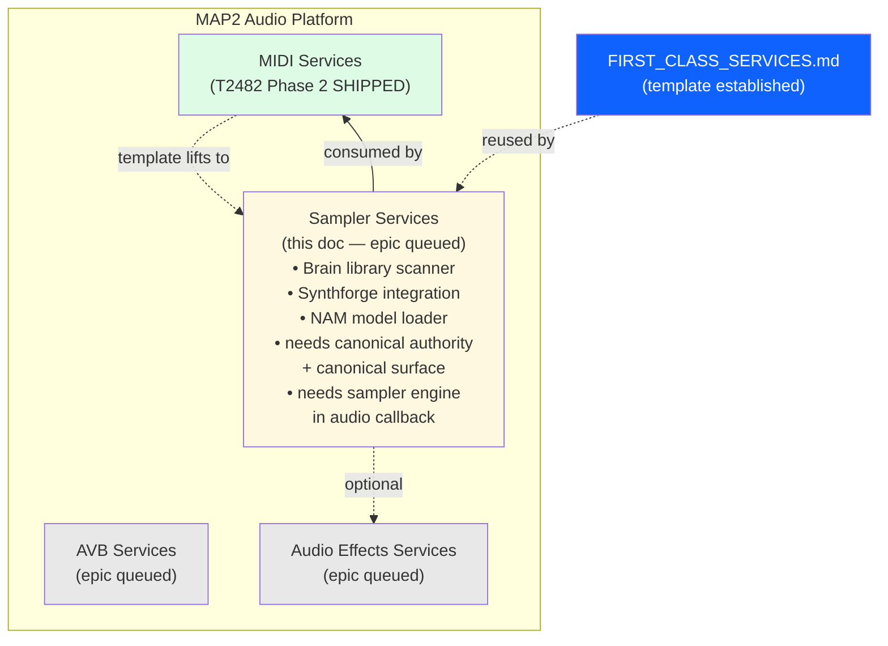

# Sampler Services — first-class platform service offering (epic stub)

**Status**: Epic stub — full design + execution pending. Architecture doc + 5 architectural diagrams provided as the starting point for the future epic per the 2026-05-01 user directive.
**Template**: This doc lifts the structure from `docs/architecture/MIDI_SERVICES.md` (the reference implementation) and customizes for Sampler. See `FIRST_CLASS_SERVICES.md` for the unification pattern + the 9-step process for opening a first-class-services epic.

---

## 1. The four-services framing position

Sampler is one of the four first-class platform service offerings (MIDI / AVB / **Sampler** / Audio Effects). It owns sample assets and sample-based instruments — SoundFonts, SFZ instruments, raw samples, drum kits, NAM models, Synthforge parts, the asset library scanner, and asset → instrument loading.

**Today's state** (2026-05-01):
- **Backend (scattered)**:
  - `app/services/performance_brain_service.py` — Brain library scanner (`_load_library_*` methods scan `/home/mm/.map2/brain-library/` for SoundFont/SFZ/sample/kit assets).
  - `app/services/performance_brain/models.py` — `BrainLibraryAssetModel`, `BrainLibraryCollectionModel`, `BrainLibraryStateModel`. Asset shape: `asset_id`, `name`, `asset_type` ∈ {soundfont,sfz,sample,kit,patch}, `path`, `tags`, `authored_with_devices`.
  - `app/routes/synthforge.py` — Synthforge integration (16 parts, patch loading).
  - `juce-engine/Source/Brain/PerformanceBrainProcessor.cpp` — Brain audio processor; today only generates sine test tones (`audioCallback` lines 142, 151) — **does not actually load samples**. Brain slot population is ad-hoc; no canonical loader.
  - NAM model loader: `map2:fx:nam` URI in `state_authority_uri_catalog.py`; ships empty (operator loads `.nam` files later).
- **Frontend**:
  - Brain library section at `/brain?section=library` — surfaces asset collections.
  - Brain Setup task (T2480) — Phase 4 scans the library, auto-picks first asset, populates Brain slot.
  - No standalone Sampler surface today.

**Cross-service consumer relationships**:
- **MIDI consumes Sampler**: a MIDI binding can target a Sampler instrument (key press → sampler trigger). Brain slot bindings are the most common path.
- **Audio Effects can consume Sampler**: a sampler output can feed a chain (effects in-line with the sampler).

---

## 2. Unification scope (when the epic opens)

**Canonical authority**:
- `SampleAsset` table — every loadable sound source has a canonical row. Columns: `asset_id` (UUID PK), `name`, `asset_type`, `path` (absolute), `format` (e.g., "sf2", "sfz", "wav"), `size_bytes`, `duration_ms`, `sample_rate`, `bit_depth`, `channels`, `tags` (JSON array), `provenance` fields per the four-services template.
- `SamplerInstrument` table — operator-instantiated instruments backed by an asset. Columns: `instrument_id` (UUID PK), `asset_id` (FK), `name`, `params` (JSON — per-instrument config), `created_by`, `source`, `metadata`.

**Canonical surface**: `/sampler` mount (final naming TBD). Single entry point for library browsing, asset inspector (waveform preview, format details, embedded sample-pack metadata), version management, format conversions, instrument instantiation. Old `/brain?section=library` becomes a Brain-side projection over Sampler Services.

**Migration**:
- Lift the Brain library scanner's in-memory asset list into `SampleAsset` rows.
- Lift Synthforge part configs into `SamplerInstrument` rows.
- Lift any `BrainSlotModel.asset_path` references into `SamplerInstrument` rows + replace the slot's `asset_path` with an `instrument_id` foreign key.

**Inventory (preliminary)**:
- Brain library scanner → absorbed; library state lives in canonical authority
- Brain library section UI → reframed as a Sampler region cross-linked from Brain
- Synthforge integration → reframed as a Sampler instrument backend (Synthforge becomes one of several supported instrument engines)
- NAM model loader → reframed as a Sampler instrument backend (NAM is just one instrument type)
- Brain Setup task's library-scan + asset-pick step → consumes Sampler Services API instead of Brain library directly

---

## 3. Architectural diagrams (5 required views)

### 3.1 Process topology



### 3.2 Storage layout

```mermaid
flowchart TB
    subgraph canonical["CANONICAL (post-Sampler-Services-P2.1)"]
        sample_assets[("sample_assets table\n(planned — every loadable source)")]
        sampler_instruments[("sampler_instruments table\n(planned — operator-instantiated)")]
    end

    subgraph legacy["LEGACY (in-memory + scattered)"]
        brain_library_state["Brain library scanner\nin-memory asset list"]
        brain_slot_paths["BrainSlotModel.asset_path\n(direct path strings, no FK)"]
        synthforge_parts["Synthforge part configs\n(in-memory, file-backed)"]
    end

    subgraph filesystem["~/.map2/brain-library/ (filesystem, unchanged)"]
        files[("SoundFont / SFZ / sample\n/ kit / NAM files")]
    end

    files -->|scanned by| brain_library_state
    files -.->|scanned by\n(planned)| sample_assets

    brain_library_state -.->|future migration| sample_assets
    brain_slot_paths -.->|future migration| sampler_instruments
    synthforge_parts -.->|future migration| sampler_instruments

    style canonical fill:#defbe6
    style sample_assets fill:#fff8e1
    style sampler_instruments fill:#fff8e1
    style legacy fill:#fff8e1
```

### 3.3 Consumer surface



### 3.4 Migration narrative



(Red box = critical gap. Sampler Services Phase 1 has to decide whether to build a native SoundFont/SFZ sampler engine in C++ OR adopt a third-party library; today the platform's "Brain plays samples" claim is essentially unimplemented at the audio engine layer — the Brain processor only generates sine tones.)

### 3.5 Four-services framing position



---

## 4. References

- `docs/architecture/FIRST_CLASS_SERVICES.md` — the template this doc lifts from
- `docs/architecture/MIDI_SERVICES.md` — reference implementation
- `app/services/performance_brain_service.py` — current Brain library scanner
- `app/services/performance_brain/models.py` — `BrainLibraryAssetModel` shape
- `app/routes/synthforge.py` — current Synthforge integration
- `juce-engine/Source/Brain/PerformanceBrainProcessor.cpp` — Brain audio processor (the sampler engine gap)
- `~/.claude/projects/-home-mm-map2-audio/memory/MEMORY.md` — Brain notes
