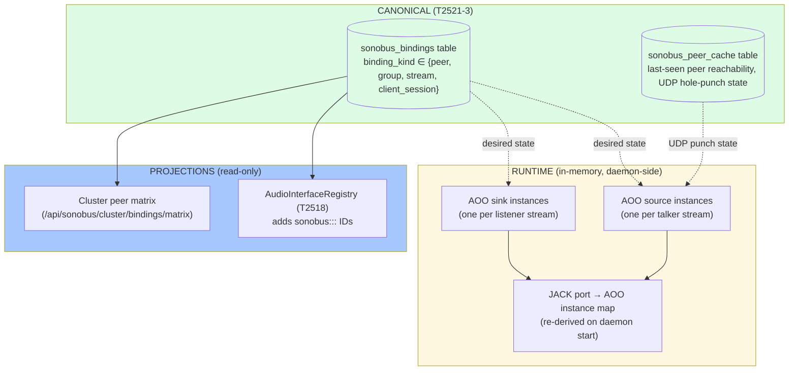
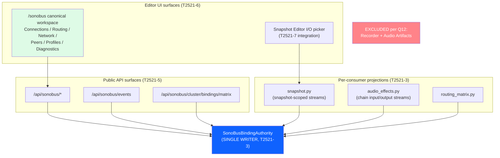

# SonoBus / AOO Remote-Audio Transport — first-class platform service offering

**Status:** T2521 epic OPENED 2026-05-13 after the 5-question decision protocol locked 21 answers (see PROJECT_WORKLIST §T2521). This doc is the T2521-2 deliverable — the AVB-template architecture doc that downstream sub-tasks (T2521-3 → T2521-10) consume.
**Template:** Lifts the structure from `docs/architecture/AVB_SERVICES.md` (the T2490/T2496 reference implementation) and customizes for SonoBus/AOO. See `FIRST_CLASS_SERVICES.md` for the unification pattern.
**Supersedes:** `T2520` — the evaluation/lab-prototype epic. Operator confirmed security is not a blocker and requested full AVB-template integration on 2026-05-13. T2520 is preserved as historical review context but does not execute.

---

## 0. T2521 locked decisions (5-question protocol, 2026-05-13)

The protocol locked Q1–Q21. Each decision is the canonical reference for downstream sub-tasks. Continuation controls (Q5, Q11, Q16, Q21) are omitted from this table.

| Q | Decision |
|---|---|
| **Q1** | **B — Direct MAP2-owned AOO daemon from day one.** Do not make full headless SonoBus the long-term runtime. Headless SonoBus may be used only as a short-lived prototype (T2520 closure), not as production. |
| **Q2** | **A — "SonoBus" at `/sonobus`.** Operator mount and brand surface match SonoBus to operators familiar with the protocol. |
| **Q3** | **A — MAP2 installs/runs its own local AOO/SonoBus connection server by default.** Self-hosted by default; no reliance on third-party rendezvous servers. |
| **Q4** | **C — MAP2-to-MAP2 first; non-MAP2 SonoBus clients visible but degraded/unsupported.** Cluster-aware peer model is canonical; non-MAP2 SonoBus clients tolerated but flagged. |
| **Q6** | **D — Mirror AVB exactly.** Storage layout, authority pattern, and config plane match `AvbBindingAuthority` semantics. Avoid user-scoped recents/preferences unless AVB has an equivalent. |
| **Q7** | **A — MAP2-to-MAP2 default format: PCM 24-bit / 48 kHz with the lowest practical jitter buffer.** Matches MAP2's 48 kHz / 64-sample audio invariants. |
| **Q8** | **A — Non-MAP2 client default: same PCM 24-bit / 48 kHz profile.** No Opus default for v1; codec slot reserved for future expansion. |
| **Q9** | **A — Optimize for lowest latency and tolerate occasional dropouts.** Posture matches MAP2's "live guitar performance < 5 ms" target. |
| **Q10** | **A — First-class snapshot input/output interfaces and routing-matrix endpoints.** SonoBus endpoints appear wherever AVB and cluster endpoints appear (T2518 interface registry, snapshot picker, routing matrix). |
| **Q12** | **D — No recorder/artifact integration for this transport.** Explicit exclusion of MAP2 Recorder + Audio Artifacts; regression checks must enforce this. |
| **Q13** | **A+ — Exact AVB-style workspace.** `/sonobus` exposes Connections, Routing, Network, Peers/Devices, Profiles, Diagnostics with every useful service/interface/design option surfaced (not hidden behind "advanced"). |
| **Q14** | **C — Full multichannel from day one,** matching SonoBus channel-group behavior. |
| **Q15** | **A+ — Installed and enabled by default,** detected/negotiated/included in network clustering and node negotiation. |
| **Q17** | **A — Cluster/node negotiation mirrors AVB:** mDNS discovery, cluster peer matrix, per-node transport capabilities, authority-backed bindings. |
| **Q18** | **A — Prefer AVB automatically; SonoBus/AOO is fallback.** When both transports can carry the same routing intent, AVB wins; SonoBus takes over only if AVB is unavailable on a path. |
| **Q19** | **B — Same-LAN two-node plus network-loss/jitter emulation.** No WAN-only validation gate for v1. |
| **Q20** | **A — Vendor AOO source into this repo with preserved license notices.** `vendor/aoo/` carries upstream license + notices; `THIRD_PARTY_NOTICES.md` is updated atomically with vendor adds. |

**Licensing posture.** AOO is upstream BSD-3 (`https://aoo.iem.at/`); SonoBus is GPLv3. MAP2 vendors AOO source directly. SonoBus's GPLv3 binary is referenced (and packaged as the operator-facing brand name on `/sonobus`), but the *runtime* in production is the MAP2-owned AOO daemon — not a launched SonoBus headless process — so the GPLv3 boundary stays cleanly outside MAP2's process tree. See §6 (Licensing) and `docs/architecture/LICENSE_COMPATIBILITY.md`.

**AOO vs SonoBus dispute resolution.** AOO is the underlying P2P audio-over-UDP protocol (BSD-3, IEM-developed). SonoBus is a JUCE-based application that uses AOO. The decision lock (Q1) is *direct AOO daemon from day one*: MAP2 does not ship a headless SonoBus binary as the runtime. `/sonobus` is the operator mount/brand name (Q2); the daemon is `map2-sonobus-transport` (a.k.a. the AOO daemon, owned by MAP2).

---

## 1. The four-services framing position

SonoBus/AOO is not a fifth platform service — it is a **transport** that sits beside AVB inside the AVB Services / Audio I/O bus. The four-services framing (MIDI / AVB / Sampler / Audio Effects) stands. SonoBus is the **fallback remote-audio transport** when AVB is unavailable, and the **primary remote-audio transport** for LAN/WAN paths where AVB is not viable (no Layer-2, no MSRP-capable switch, internet/overlay).

**Today's state** (2026-05-13):
- **Backend**: no SonoBus/AOO code in tree. T2521-1 (decisions) closed in this same kickoff. T2521-3 → T2521-10 deliver the transport.
- **Frontend**: no `/sonobus` route. T2521-6 creates the workspace.
- **Cross-service consumer relationship**: Audio Effects + Snapshot Editor consume SonoBus the same way they consume AVB (input/output endpoints). The unified `AudioInterfaceRegistry` (T2518) is the seam.
- **Transport priority** (per Q18): when a snapshot or routing rule names a node-to-node audio path, the resolver tries AVB first, falls back to SonoBus/AOO. Operator can pin a binding to one transport.

---

## 2. Unification scope

**Canonical authority**: `SonoBusBinding` table — every operator-visible peer/group/stream binding lives here. Mirrors `AvbBinding` from T2490 with SonoBus-specific fields. **Single writer rule:** `SonoBusBindingAuthority.write()` is the only mutation path. The AOO daemon, the cluster reconciler, and the snapshot/routing projections all *consume* the authority.

**Canonical surface**: `/sonobus` mount per Q2. Single entry point for peers, groups, sessions, routing, network/PTP-equivalent (NTP/clock), diagnostics. No legacy mount to redirect (greenfield).

**Inventory (T2521 kickoff, 2026-05-13)**:

| Surface | Planned LoC / file count | Disposition |
|---|---|---|
| `vendor/aoo/` | ~30–50 KLoC vendored (upstream) | Source + LICENSE + NOTICE preserved verbatim; build hook in `juce-engine/CMakeLists.txt` (T2521-4) |
| `app/services/sonobus/` (new) | ~2,000 LoC | `binding_authority.py`, `binding_models.py`, `binding_schemas.py`, `transport_runtime.py`, `peer_discovery.py`, `cluster_reconciler.py` (T2521-3, T2521-4) |
| `app/routes/sonobus/` (new) | ~1,500 LoC | `bindings.py`, `peers.py`, `sessions.py`, `routing.py`, `network.py`, `diagnostics.py`, `common.py` (T2521-5) |
| `app/services/devices/sonobus_daemon_supervisor.py` (new) | ~400 LoC | systemd-aware supervisor: lifecycle, restart, health, metrics scrape (T2521-4) |
| `map2-sonobus-transport/` (new daemon binary) | ~3,000 LoC C++ | AOO source/sink + JACK/PipeWire client + UDS IPC to `app/` (T2521-4) |
| `web/src/app/pages/sonobus/` (new) | ~3,500 LoC | `SonoBusServicesShell.tsx`, `SonoBusOverviewPage.tsx`, `SonoBusConnectionsPage.tsx`, `SonoBusRoutingPage.tsx`, `SonoBusNetworkPage.tsx`, `SonoBusPeersPage.tsx`, `SonoBusProfilesPage.tsx`, `SonoBusDiagnosticsPage.tsx` (T2521-6) |
| `web/src/app/components/SonoBus/` (new) | ~2,000 LoC | Shared cards: peer card, session card, codec/jitter profile editor, latency meter, packet-loss sparkline (T2521-6) |
| `systemd/map2-sonobus-transport.service` (new) | ~80 LoC | Service unit; pinned to non-RT CPUs (0–3); `AmbientCapabilities=CAP_NET_BIND_SERVICE` if connection server uses <1024; default port range above 10000 (T2521-8) |
| `installer/` updates | ~200 LoC | RPM spec dependency, port allowlist, default-on flag, AOO daemon launch (T2521-8) |
| Snapshot/interface picker integration | ~300 LoC | T2518's `AudioInterfaceRegistry` gains `sonobus:<peer_id>:<group_id>:<stream_id>` IDs; snapshot picker shows them (T2521-7) |

---

## 2.3 Sub-task plan (recapped from PROJECT_WORKLIST §T2521)

10 sub-tasks; **T2521-1 done at kickoff**, T2521-2 is this doc. Estimated total: 22–28 SHIP iters across the autonomous Continue loop.

| Sub-task | Iters | Description |
|---|---|---|
| **T2521-1** Lock decisions | 0 (done) | 5-question protocol Q1–Q21 (kickoff). |
| **T2521-2** Architecture doc | 1 (this doc) | AVB-template doc with locked decisions, data model, API surface, GUI regions, installer scope, risk register, validation gates. |
| **T2521-3** Transport authority + persistence | 2–3 | `SonoBusBindingAuthority`, `SonoBusBinding` table, migrations, schemas, tests. |
| **T2521-4** Daemon runtime | 3–4 | `map2-sonobus-transport` C++ daemon + AOO vendor build + supervisor + JACK/PipeWire client + UDS IPC. RT-isolated. |
| **T2521-5** REST + WS | 2 | `/api/sonobus/*` routes + `/api/sonobus/events` event stream. |
| **T2521-6** Carbon workspace | 3–4 | `/sonobus` shell + 7 region pages + shared components. |
| **T2521-7** Snapshot/routing integration | 2 | `AudioInterfaceRegistry` adds SonoBus IDs; snapshot picker + routing matrix surface them. Explicit Recorder/Artifact exclusion regression tests. |
| **T2521-8** Installer/RPM/systemd/firewall | 2–3 | RPM spec, service unit, firewall (firewalld zone), env, package manifest, rollback. |
| **T2521-9** Licensing/notices | 1 | AOO BSD-3 + SonoBus GPLv3 notices; vendor manifest; compliance checklist. |
| **T2521-10** Validation + soak | 2–3 | LAN two-node + impairment matrix (loss/jitter/reorder); UI smoke; installer smoke; soak evidence under `docs/fit-for-purpose-evidence/<date>/t2521-sonobus/`. |

---

## 2.4 The `SonoBusBinding` data model (T2521-3)

The cornerstone of T2521 is a single canonical binding model that owns every operator-visible SonoBus/AOO intent. Mirrors `AvbBinding` with SonoBus/AOO-specific fields:

```python
# app/services/sonobus/binding_models.py (T2521-3)

@dataclass
class SonoBusBinding:
    # Identity (mirrors AvbBinding)
    binding_id: str             # UUID
    binding_kind: str           # "peer" | "group" | "stream" | "client_session"
    enabled: bool
    scope: str                  # "host" | "node" | "cluster"
    scope_id: Optional[str]     # node_id when scope="node"
    consumer_id: Optional[str]  # snapshot_id / chain_id / device profile when bound

    # Source side (talker) — the local AOO source instance
    talker_node_id: str
    talker_source_id: int       # AOO source ID (32-bit)
    talker_channel_count: int   # 1..N (Q14: multichannel from day one)

    # Sink side (listener) — the remote AOO sink instance
    listener_node_id: str               # MAP2-to-MAP2 case (Q4)
    listener_peer_endpoint: str         # "host:port" or "peer_id@server"
    listener_sink_id: int               # AOO sink ID on the remote
    listener_capability: str            # "map2" | "sonobus_native" | "aoo_native"

    # Group / session (SonoBus channel-group semantics, Q14)
    group_id: str               # SonoBus group identifier
    group_password_hash: Optional[str]  # bcrypt; never stored in plaintext
    session_label: str          # operator-visible

    # Stream parameters (Q7/Q8/Q9)
    stream_format: str          # "pcm_s24_48000" (default per Q7/Q8)
    codec_profile: str          # "pcm" | future: "opus_lowlatency" | "opus_voip"
    jitter_buffer_ms: int       # default 4 ms (Q9 — lowest practical)
    resend_policy: str          # "off" | "burst_loss_only" | "full" (Q9 default: burst_loss_only)
    latency_target_ms: int      # operator-pinned cap (default 8 ms)

    # Network
    transport_protocol: str     # "udp" | "udp_tls" (future)
    bind_interface: str         # e.g. "eth0", "wlan0", "any"
    bind_port_local: Optional[int]
    server_endpoint: str        # MAP2-owned connection server (Q3)

    # Cluster topology (Q17)
    cluster_role: str           # "primary" | "fallback" | "peer"
    transport_priority: str     # "avb_preferred" | "sonobus_preferred" | "sonobus_only" (Q18 default: avb_preferred)

    # Provenance
    created_at: datetime
    created_by_node: str
    last_modified_at: datetime
    last_modified_by_node: str
    runtime_extra: dict         # transport_metrics, schema_version, migrated_from, etc.
```

**Single writer rule:** `SonoBusBindingAuthority.write()` is the only mutation path. The daemon supervisor, peer-discovery service, cluster reconciler, and snapshot/routing projections all *consume* the authority.

**Cluster-aware from day one (Q17):** every binding carries `talker_node_id` + `listener_node_id`; REST surface accepts `node_id=` query for projection scoping (mirrors MIDI/AVB pattern).

**Transport priority semantics (Q18):** the resolver picks AVB first if both AVB and SonoBus can satisfy a binding intent. `transport_priority = "avb_preferred"` is the default. Operators can pin a binding to `"sonobus_preferred"` or `"sonobus_only"` per-row.

---

## 2.5 Migration strategy

### 2.5.1 Greenfield — no in-tree state to migrate

Unlike T2490 (AVB) which migrated 2,630 LoC of router state, T2521 is greenfield: no SonoBus/AOO code exists in tree today. No migration is needed for the canonical authority itself.

### 2.5.2 Snapshot/routing migration (T2521-7)

The integration touches three existing surfaces:

1. **T2518 `AudioInterfaceRegistry`** — gains a `sonobus:` ID space. Existing PipeWire / AVB / cluster IDs are unchanged. The picker auto-discovers SonoBus interfaces via the authority's `list_bindings(binding_kind="stream", enabled=True)` projection.
2. **Snapshot Editor I/O picker** — no schema change; the SonoBus IDs flow through `AudioStateDesiredIO.input_interface_id` / `output_interface_id` (T2518) like any other interface ID.
3. **Routing matrix** — `web/src/app/components/AvbRouting/` is the AVB-only matrix today. T2521-7 either (a) extends it to multi-transport (preferred), or (b) creates a sibling SonoBus routing region under `/sonobus/routing`. Q13 (A+ exact AVB workspace) lands on path (b) for v1 — the SonoBus routing region stands on its own at `/sonobus/routing`. A cross-transport overlay is a post-v1 task.

### 2.5.3 Recorder/Artifact exclusion (Q12)

**Hard exclusion.** No SonoBus/AOO endpoints feed the Recorder service. No SonoBus bindings appear under Audio Artifacts. Enforced by:

- `app/services/recorder/recorder_service.py` regression test asserting `SonoBusBinding` IDs are rejected as recording sources/sinks with a 422.
- `web/src/app/components/Recorder/RecorderInterfacePicker.tsx` filters out `sonobus:` IDs from the registry.
- A worklist-tracked exclusion doc: `docs/architecture/SONOBUS_NO_RECORDER.md` (one-page rationale citing Q12).

### 2.5.4 Rollback

Per the T2454 versioned-migration pattern, the SonoBus binding table is reversible. Disabling SonoBus universally:

1. `systemctl stop map2-sonobus-transport.service` — daemon goes away.
2. `UPDATE sonobus_bindings SET enabled=0 WHERE 1=1` — authority projection goes empty.
3. `AudioInterfaceRegistry` projection drops `sonobus:` IDs (the projection is cache-driven).
4. Snapshots that pointed at SonoBus interfaces fall back to their display-name resolver (T2518 back-compat).

The rollback migration deletes the binding rows but leaves the daemon + service unit on disk for a re-enable.

---

## 2.6 Risk register

| # | Risk | Mitigation |
|---|---|---|
| 1 | AOO upstream API surface changes between point releases | Wrapper inside `map2-sonobus-transport` daemon shields the authority. Any AOO upgrade is a separate task with a vendor-bump checklist. |
| 2 | Daemon crash takes down audio | Daemon runs as a non-RT user-space process; JUCE engine is unaffected by daemon death. Supervisor restarts with exponential backoff (1 → 30 s, cap 60 s). Routing falls back to AVB per Q18. |
| 3 | Connection server (MAP2-hosted) is single-point-of-failure | Connection server is optional once peers have discovered each other (UDP hole-punching cache). mDNS LAN discovery (Q17) gives a server-free path on local networks. |
| 4 | Multichannel (Q14) inflates packet rate | Channel-group packing matches SonoBus upstream behavior — multiple channels in one AOO source. Per-binding `channel_count` cap (default 32, configurable). |
| 5 | Lowest-jitter target (Q9) causes audible dropouts in real networks | Per-binding `jitter_buffer_ms` is operator-tunable; default 4 ms with adaptive ramp on observed loss. Diagnostics page exposes the per-binding adaptive state. |
| 6 | GPLv3 contamination from SonoBus binary | The runtime is MAP2-owned AOO (BSD-3), not SonoBus. The SonoBus brand on `/sonobus` is a UI label, not a linkage. `docs/architecture/LICENSE_COMPATIBILITY.md` documents the boundary. T2521-9 ships the audit. |
| 7 | T2518 `AudioInterfaceRegistry` not yet shipped | T2521-7 has a soft dependency on T2518; if T2518 is still in progress when T2521-7 starts, T2521-7 implements its own minimal interface registry shim and switches to T2518 once available. |
| 8 | Cluster matrix endpoint blocks on slow peer | 2 s per-peer timeout (matches T2484/T2490 pattern). |
| 9 | Firewall blocks the daemon's UDP port range | T2521-8 installs a firewalld zone fragment opening the default port range (10000–10100). Documented + rollback-able. |
| 10 | Operator confusion between "SonoBus" brand and "AOO" runtime | UI shows "SonoBus" everywhere operator-facing (Q2). Backend logs and metrics say `map2-sonobus-transport`. Architecture doc + `/sonobus/diagnostics` page have a "What is this?" footer. |
| 11 | Recorder/Artifact inclusion regression | T2521-7 ships a recorder-exclusion regression test that runs in CI; the regression fires if any code path passes a `sonobus:` ID into recorder/artifact entry points. |
| 12 | Default-on (Q15) causes noise on fresh installs without remote peers | Default-on means *daemon installed and running*, not *bindings created*. With zero bindings, the daemon is idle (no audio threads, no network egress beyond mDNS multicast). |

---

## 3. Architectural diagrams (5 required views)

### 3.1 Process topology

```mermaid
flowchart LR
    subgraph host["Host process — app/ (FastAPI on :8080)"]
        sonobus_routes["/api/sonobus/* routes\n(T2521-5)"]
        sonobus_authority["SonoBusBindingAuthority\n(T2521-3 — single writer)"]
        sonobus_projections["Per-consumer projections\n(snapshot, audio_effects,\nrouting matrix)"]
        supervisor["sonobus_daemon_supervisor\n(T2521-4)"]
    end

    subgraph daemon["map2-sonobus-transport (new C++ daemon, T2521-4)"]
        aoo_runtime["AOO source/sink runtime\n(vendor/aoo/, BSD-3)"]
        jack_client["JACK / PipeWire client\n(audio handoff)"]
        uds_bridge["UDS IPC bridge\n(commands + status events)"]
    end

    subgraph juce_engine["juce-engine (C++ audio)"]
        audio_callback["audio callback\n(RT thread,\nconsumes JACK ports)"]
    end

    subgraph network["Network (UDP)"]
        connection_server["MAP2-hosted connection server\n(Q3, optional once peers known)"]
        remote_map2["Remote MAP2 nodes\n(Q4 primary)"]
        non_map2["Non-MAP2 SonoBus/AOO clients\n(Q4 degraded)"]
    end

    sonobus_routes -->|reads/writes| sonobus_authority
    sonobus_projections --> sonobus_authority
    sonobus_authority -->|desired state| supervisor
    supervisor -.->|UDS commands| uds_bridge
    uds_bridge --> aoo_runtime
    uds_bridge -.->|status events| supervisor
    aoo_runtime --> jack_client
    jack_client <-->|JACK ports| audio_callback
    aoo_runtime <-->|UDP audio + control| connection_server
    aoo_runtime <-->|UDP P2P| remote_map2
    aoo_runtime <-->|UDP P2P (degraded)| non_map2

    style sonobus_authority fill:#0f62fe,color:#fff
    style sonobus_routes fill:#0f62fe,color:#fff
    style sonobus_projections fill:#a6c8ff
    style supervisor fill:#198038,color:#fff
    style aoo_runtime fill:#198038,color:#fff
```

### 3.2 Storage layout



### 3.3 Consumer surface



### 3.4 Migration / build-out narrative

```mermaid
flowchart LR
    subgraph today["TODAY (2026-05-13)"]
        decisions_locked["T2521-1\nDecisions Q1–Q21 locked"]
        no_code["No SonoBus/AOO code in tree"]
    end

    subgraph phase_1["Phase 1 (T2521-2, T2521-3)"]
        arch_doc["Architecture doc\n(this doc)"]
        authority["SonoBusBindingAuthority\n+ models + schemas"]
    end

    subgraph phase_2["Phase 2 (T2521-4, T2521-5)"]
        daemon["map2-sonobus-transport\ndaemon + AOO vendor"]
        routes["/api/sonobus/* + /api/sonobus/events"]
    end

    subgraph phase_3["Phase 3 (T2521-6, T2521-7)"]
        workspace["/sonobus Carbon workspace\n7 region pages"]
        snapshot_integ["Snapshot picker + routing\nintegration; recorder exclusion"]
    end

    subgraph phase_4["Phase 4 (T2521-8, T2521-9, T2521-10)"]
        installer["RPM + systemd + firewall\n+ env + rollback"]
        notices["AOO BSD-3 + SonoBus GPLv3\nthird-party notices"]
        soak["LAN two-node + impairment\nsoak + UI smoke"]
    end

    decisions_locked --> arch_doc
    no_code --> authority
    arch_doc --> authority
    authority --> daemon
    authority --> routes
    daemon --> routes
    daemon --> workspace
    routes --> workspace
    workspace --> snapshot_integ
    snapshot_integ --> installer
    installer --> notices
    notices --> soak

    style today fill:#defbe6
    style phase_1 fill:#fff8e1
    style phase_2 fill:#fff8e1
    style phase_3 fill:#e8e8e8
    style phase_4 fill:#e8e8e8
```



### 3.5 Four-services framing position

```mermaid
flowchart TB
    subgraph platform["MAP2 Audio Platform"]
        midi["MIDI Services\n(T2482 SHIPPED)"]
        avb["AVB Services\n(T2490 + T2496 SHIPPED)\n• la_avdecc backend\n• AvbBindingAuthority"]
        sampler["Sampler Services\n(epic queued)"]
        effects["Audio Effects Services\n(epic queued)"]
        sonobus["SonoBus/AOO Remote-Audio Transport\n(T2521 — this doc)\n• AOO vendor (BSD-3)\n• SonoBusBindingAuthority\n• fallback to AVB per Q18"]
    end

    template["FIRST_CLASS_SERVICES.md\n(template established)"]

    avb -.->|template lifts to| sonobus
    template -.->|reused by| sonobus

    avb <-->|transport-priority resolver\n(Q18: AVB preferred)| sonobus
    effects -->|consumes| sonobus
    effects -->|consumes| avb

    style midi fill:#defbe6
    style avb fill:#defbe6
    style sonobus fill:#fff8e1
    style sampler fill:#e8e8e8
    style effects fill:#e8e8e8
    style template fill:#0f62fe,color:#fff
```

---

## 4. API surface (T2521-5)

All routes mount under `/api/sonobus/*`. WebSocket events at `/api/sonobus/events`. OpenAPI tag: `SonoBus`.

| Route | Method | Purpose |
|---|---|---|
| `/api/sonobus/status` | GET | Daemon + authority + connection-server health summary. Cluster-projection capable (`?node_id=`). |
| `/api/sonobus/bindings` | GET | List bindings. Filters: `binding_kind`, `enabled`, `scope`, `scope_id`, `consumer_id`. |
| `/api/sonobus/bindings` | POST | Create binding (authority-mediated). |
| `/api/sonobus/bindings/{binding_id}` | GET / PATCH / DELETE | Single binding CRUD. |
| `/api/sonobus/peers` | GET | Discovered peers (mDNS + connection-server). Includes `capability` (map2 / sonobus_native / aoo_native). |
| `/api/sonobus/peers/{peer_id}/probe` | POST | One-shot reachability + RTT probe. |
| `/api/sonobus/groups` | GET / POST | SonoBus group/session management (Q14). |
| `/api/sonobus/groups/{group_id}` | GET / PATCH / DELETE | Single group CRUD. |
| `/api/sonobus/sessions` | GET | Active sessions (live streams). |
| `/api/sonobus/sessions/{session_id}/disconnect` | POST | Tear down. |
| `/api/sonobus/profiles` | GET / POST | Codec + jitter profile presets. |
| `/api/sonobus/profiles/{profile_id}` | GET / PATCH / DELETE | Single profile CRUD. |
| `/api/sonobus/network` | GET | Bind interfaces, ports, NAT/STUN state, mDNS state. |
| `/api/sonobus/network/connection-server` | GET / PATCH | MAP2-hosted connection-server lifecycle (Q3). |
| `/api/sonobus/diagnostics` | GET | Per-binding metrics: RTT, loss, jitter, resends, observed latency. |
| `/api/sonobus/cluster/bindings/matrix` | GET | Peer-fan-out cluster projection (mirrors AVB matrix, 2 s per-peer timeout). |
| `/api/sonobus/events` | WS | Push events: peer-up/down, session-start/stop, metric snapshots (1 Hz), authority writes. |

**Error envelope**: standard MAP2 envelope (`{ "error": { "code": ..., "message": ..., "details": null } }`). New error codes registered in `docs/api-contract-standards.md` under T2521-5:

- `sonobus.daemon_unreachable`
- `sonobus.peer_capability_unsupported`
- `sonobus.binding_conflict`
- `sonobus.transport_disabled_for_recorder` (Q12 enforcement)

---

## 5. GUI surface (T2521-6)

Carbon workspace at `/sonobus`. Region pages mirror AVB Services (Q13 A+).

| Region | Path | Contents |
|---|---|---|
| Overview | `/sonobus` | Daemon health card · connection-server card · peer count · active sessions · latency sparkline · AVB-vs-SonoBus transport-priority indicator |
| Connections | `/sonobus/connections` | DataTable of bindings (filter/search), per-row Enable/Disable/Delete, "New connection" wizard |
| Routing | `/sonobus/routing` | Matrix UI (talker × listener) — separate from AVB's matrix; see §2.5.2 |
| Network | `/sonobus/network` | Bind interfaces · UDP ports · NAT/STUN state · mDNS state · connection-server config (start/stop/restart) |
| Peers | `/sonobus/peers` | Discovered peers (mDNS + connection-server) · capability tag (map2 / sonobus_native / aoo_native) · probe button · peer-binding drill-down drawer |
| Profiles | `/sonobus/profiles` | Codec + jitter profile presets (PCM default + reserved Opus slots) |
| Diagnostics | `/sonobus/diagnostics` | Per-binding live metrics: RTT, loss %, jitter ms, resends/s, observed latency ms · packet-loss sparkline · adaptive-jitter trace |

**Carbon conformance**: every page uses `@carbon/react` (DataTable, Tile, Tag, InlineLoading, Toggle, Modal, NumberInput, ComboBox). No MUI. No Phosphor.

**Status-Tag tone policy** (matches AVB/MIDI Services):
- green = "OK" / "Connected" / "Healthy"
- warm-gray = "Idle" / "Disabled"
- amber = "Degraded" / "High loss" / "Capability fallback"
- red = "Failed" / "Daemon down" / "Server unreachable"

**Cluster auto-connect onboarding modal**: lifted from T2486 (`AvbServicesOverviewPage` cluster modal). First-visit, dismissible, no-coaching.

---

## 6. Licensing (T2521-9)

**AOO** — BSD-3 (Christof Ressi, IEM). Vendored at `vendor/aoo/`. Upstream LICENSE preserved verbatim; NOTICE preserved verbatim. Build is part of the JUCE engine's `cmake -B build` flow with `option(USE_SONOBUS "Build SonoBus/AOO transport" ON)` (default ON per Q15). Compatible with MAP2's AGPLv3 application surface (BSD-3 is permissive; one-way upgrade to AGPLv3 is allowed).

**SonoBus** — GPLv3 (Jesse Chappell). MAP2 does **not** ship the SonoBus binary in production (Q1 chose the AOO daemon path). The `/sonobus` operator brand is a UI label and a route mount, not a linkage. If a future task vendors any SonoBus code (the JUCE mapping plugin, the connection-server source), the GPLv3 boundary is documented in `docs/architecture/LICENSE_COMPATIBILITY.md` and the affected components stay in a process-isolated boundary (separate binary, not linked into the JUCE engine or the FastAPI app).

**Third-party notices update** (T2521-9):
- `THIRD_PARTY_NOTICES.md` — new section "AOO (Audio Over OSC) — BSD-3 — vendored at vendor/aoo/" with the full BSD-3 text.
- `docs/architecture/LICENSE_COMPATIBILITY.md` — new row for AOO with the compatibility analysis.
- RPM `%license` files list updated (T2521-8 cross-link).
- Compliance checklist evidence in `docs/fit-for-purpose-evidence/<date>/t2521-sonobus/licensing/`.

---

## 7. Validation gates (T2521-10)

Per Q19 (same-LAN + impairment matrix). No WAN-only validation for v1.

| Gate | Criterion |
|---|---|
| Two-node LAN PCM 24-bit/48 kHz | < 8 ms one-way at 0 % loss; 0 xruns over 10 min |
| Impairment: 0.1 % loss + 2 ms jitter | < 15 ms one-way (adaptive jitter), < 1 audible dropout / min |
| Impairment: 1 % loss + 5 ms jitter | < 30 ms one-way; documented dropout rate |
| Cluster matrix fan-out | All peers respond < 2 s with timeout enforcement |
| Recorder exclusion regression | All recorder code paths reject `sonobus:` IDs with 422 |
| Snapshot picker round-trip | Save → reload → SonoBus interface ID preserved |
| Default-on fresh install | RPM upgrade enables daemon; idle with 0 bindings (no audio threads, no network egress beyond mDNS) |
| UI smoke (all 7 regions) | Each page renders without console error against a live daemon |
| Carbon conformance | Page-level review against `docs/design/CARBON_CONTRIBUTION_REVIEW_CHECKLIST.md` |

Evidence directory: `docs/fit-for-purpose-evidence/<YYYYMMDD>/t2521-sonobus/`.

---

## 8. References

- `docs/architecture/AVB_SERVICES.md` — T2490/T2496 reference; this doc lifts from it.
- `docs/architecture/FIRST_CLASS_SERVICES.md` — four-services template.
- `docs/architecture/MIDI_SERVICES.md` — T2482 reference implementation (the original template AVB lifted from).
- `docs/architecture/CONTROLLER_LAYER.md` — process-isolation precedent for `map2-controller-host`; `map2-sonobus-transport` follows the same crash-isolation pattern.
- `docs/architecture/LICENSE_COMPATIBILITY.md` — AGPLv3 + BSD-3 + GPLv3 compatibility matrix.
- `docs/api-contract-standards.md` — error envelope, operation-ID rules, versioning.
- `docs/design/CARBON_CONFORMANCE_STANDARD.md` — `/sonobus` workspace conformance.
- `docs/PROJECT_WORKLIST.md` §T2521 — epic entry with sub-task list and locked decisions.
- `~/.claude/projects/-home-mm-map2-audio/memory/MEMORY.md` — user/project memory; T2521 entry to be added.
- AOO upstream: BSD-3 audio-over-OSC protocol, IEM-developed.
- SonoBus upstream: GPLv3, https://sonobus.net/, https://github.com/essej/sonobus.
