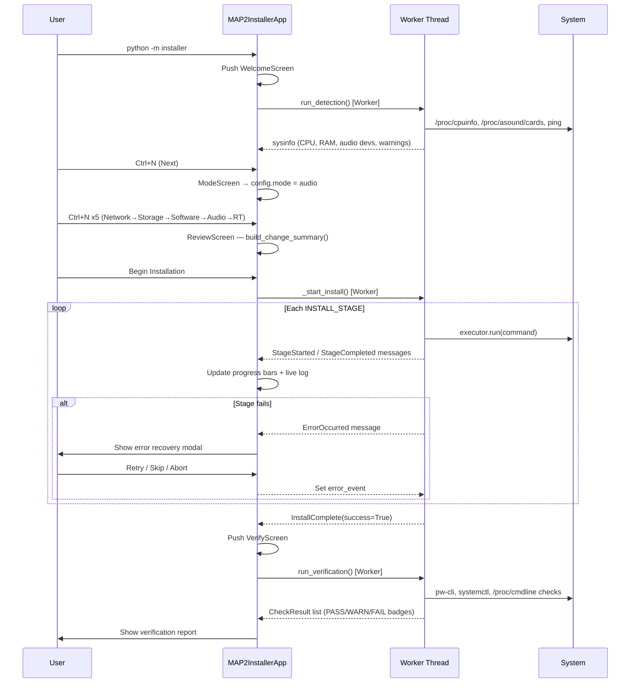

# MAP2 Audio Platform — Enterprise Educational Installer

> **Anaconda/Kickstart-inspired · Textual TUI · Fully educational · Idempotent**

A world-class, enterprise-grade interactive installer for the MAP2 Modular Audio Platform.
Built in the spirit of Fedora's Anaconda text-mode installer with educational content at every step.

---

## Quick Start

### Interactive TUI (recommended)

```bash
# Install installer dependencies
pip install -r requirements-installer.txt

# Launch the TUI
python -m installer

# Or with a shell wrapper
./install --tui
```

### Unattended / Scripted (CI/CD, remote provisioning)

```bash
# 1. Generate a Kickstart template for your mode
python -m installer --generate-ks audio > my-host.yaml

# 2. Edit the YAML to match your environment
nano my-host.yaml

# 3. Validate before running
python -m installer --validate-ks my-host.yaml

# 4. Run unattended
sudo python -m installer --unattended my-host.yaml

# Dry-run first (no changes made)
sudo python -m installer --unattended my-host.yaml --dry-run
```

### Other options

```bash
python -m installer --help
python -m installer --stage 5          # Start TUI at Audio screen
python -m installer --generate-ks all-in-one > aio.yaml
```

---

## Architecture

### Component Diagram

```mermaid
graph TB
    subgraph Entry["Entry Point"]
        MAIN["__main__.py<br/>CLI arg parser<br/>TUI / unattended / generate-ks"]
    end

    subgraph Config["config/"]
        SCHEMA["schema.py<br/>InstallerConfig<br/>Pydantic v2 models"]
        KS["kickstart.py<br/>YAML load/save<br/>validate_kickstart_file"]
        DEF["defaults.py<br/>Per-mode defaults<br/>MODE_DESCRIPTIONS"]
    end

    subgraph UI["ui/"]
        APP["installer.py<br/>MAP2InstallerApp<br/>Screen stack manager"]
        subgraph Screens["ui/screens/"]
            S00["welcome.py<br/>Stage 00: Auto-detect"]
            S01["mode.py<br/>Stage 01: Mode picker"]
            S02["network.py<br/>Stage 02: Network + ping"]
            S03["storage.py<br/>Stage 03: Paths + disk"]
            S04["software.py<br/>Stage 04: Components"]
            S05["audio.py<br/>Stage 05: Interface + buffer"]
            S06["realtime.py<br/>Stage 06: RT + GRUB preview"]
            S07["users.py<br/>Stage 07: Users + strength"]
            S08["review.py<br/>Stage 08: KS-like summary"]
            S09["install_progress.py<br/>Stage 09: Live log + bars"]
            S10["verify.py<br/>Stage 10: Health checks"]
        end
        subgraph Widgets["ui/widgets/"]
            HO["help_overlay.py<br/>F1/? modal<br/>ConfirmQuit<br/>LogViewer"]
        end
        CSS["styles/main.tcss<br/>Global TrueColor theme"]
        BASE["screens/_base.py<br/>BaseInstallerScreen<br/>Navigation · F1 help"]
    end

    subgraph Backend["backend/"]
        EX["executor.py<br/>CommandExecutor<br/>dry-run · shlex · retry"]
        SYS["system.py<br/>detect_system()<br/>CPU · RAM · audio devs"]
        PKG["packages.py<br/>PackageManager<br/>DNF / apt abstraction"]
        SVC["services.py<br/>ServiceManager<br/>systemd idempotent ops"]
        PW["pipewire.py<br/>PipeWireConfig<br/>quantum conf fragment"]
        GR["grub.py<br/>GRUBConfig<br/>safe cmdline edit"]
        BLD["build.py<br/>JUCEBuilder<br/>FrontendBuilder<br/>PythonEnvBuilder"]
        VER["verifier.py<br/>PostInstallVerifier<br/>CheckResult badges"]
    end

    subgraph Modes["modes/"]
        UNA["unattended.py<br/>UnattendedRunner<br/>headless KS install"]
    end

    MAIN --> APP
    MAIN --> UNA
    MAIN --> KS
    APP  --> BASE
    BASE --> S00 & S01 & S02 & S03 & S04 & S05 & S06 & S07 & S08 & S09 & S10
    S00  --> SYS
    S06  --> GR
    S09  --> EX & PKG & SVC & PW & GR & BLD
    S10  --> VER
    APP  --> SCHEMA & KS
    UNA  --> SCHEMA & KS & EX & PKG & SVC & PW & GR & BLD & VER
```



### Installation Flow



---

## Installer Stages

| # | Screen | Teaches | Key checks |
|---|--------|---------|-----------|
| 00 | Welcome / Detect | Environment detection, hardware requirements | CPU, RAM, audio devs, PipeWire |
| 01 | Mode Selection | MAP2 operating modes, trade-offs | Mode → sets defaults for all later screens |
| 02 | Network | Hostname rules, proxy, AVB NIC | Live ping to github.com/pypi.org |
| 03 | Storage | Disk space math, venv isolation | Live disk space meter per path |
| 04 | Software | Component dependencies, build costs | LV2 needs JUCE, AVB needs JUCE |
| 05 | Audio Interface | Latency triangle, buffer math | `latency_ms = buffer/rate * 1000` live |
| 06 | RT Config | isolcpus, nohz_full, C-states, SCHED_FIFO | GRUB cmdline preview live |
| 07 | Users | Audio group, rtkit, password security | Live password strength meter |
| 08 | Review | Kickstart-like change summary | Full YAML preview, save to file |
| 09 | Install | Live log, per-stage progress, error recovery | Retry/Skip/Abort on failure |
| 10 | Verify | Post-install health checks | RT, quantum, services, groups |

---

## File Layout

```
installer/
├── __init__.py             # Package version
├── __main__.py             # Entry point: python -m installer
├── installer.py            # Textual App + screen stack + navigation
├── config/
│   ├── schema.py           # Pydantic v2 InstallerConfig + sub-models
│   ├── kickstart.py        # YAML load/save/validate (KS round-trip)
│   └── defaults.py         # Per-mode software/RT/audio defaults
├── ui/
│   ├── screens/
│   │   ├── _base.py        # BaseInstallerScreen (F1 help, navigation)
│   │   ├── welcome.py      # Stage 00: splash + auto environment detection
│   │   ├── mode.py         # Stage 01: mode picker with descriptions
│   │   ├── network.py      # Stage 02: hostname + live ping test
│   │   ├── storage.py      # Stage 03: paths + disk space meters
│   │   ├── software.py     # Stage 04: component checklist
│   │   ├── audio.py        # Stage 05: interface + buffer + latency display
│   │   ├── realtime.py     # Stage 06: RT/GRUB with live preview
│   │   ├── users.py        # Stage 07: user + password strength meter
│   │   ├── review.py       # Stage 08: KS-like summary + confirm
│   │   ├── install_progress.py  # Stage 09: live log + error recovery
│   │   └── verify.py       # Stage 10: pass/warn/fail health check badges
│   ├── widgets/
│   │   └── help_overlay.py # F1/? modal, ConfirmQuit, LogViewer
│   └── styles/
│       └── main.tcss       # TrueColor theme, global widget styles
├── backend/
│   ├── executor.py         # Safe subprocess wrapper (dry-run, shlex, retry)
│   ├── system.py           # Hardware detection (CPU, RAM, audio, network)
│   ├── packages.py         # DNF/apt abstraction (idempotent installs)
│   ├── services.py         # systemd service management
│   ├── pipewire.py         # PipeWire config fragment writer
│   ├── grub.py             # GRUB2 cmdline editor (backup + mkconfig)
│   ├── build.py            # CMake + npm + Python venv builders
│   └── verifier.py         # Post-install health checks → CheckResult
├── modes/
│   └── unattended.py       # Headless KS installer (--unattended)
├── examples/
│   └── map2-ks.yaml        # Reference Kickstart configuration
└── tests/
    └── test_config.py      # pytest: schema, KS round-trip, executor, unattended
```

---

## Developer Guide: Adding a New Stage Screen

1. **Create the screen file** at `installer/ui/screens/newstage.py`:
   ```python
   from installer.ui.screens._base import BaseInstallerScreen

   class NewstageScreen(BaseInstallerScreen):
       SCREEN_TITLE    = "New Stage"
       SCREEN_SUBTITLE = "Description"

       def compose(self): ...
       def validate(self) -> list[str]: return []
       @property
       def help_text(self) -> str: return "# New Stage\n..."
   ```

2. **Register in the app** at `installer/installer.py`:
   ```python
   SCREEN_SEQUENCE = [..., "newstage", ...]
   ```

3. **Add backend logic** in `installer/backend/` if needed.

4. **Write a test** in `installer/tests/test_config.py`.

That's all.  The base class handles F1 help, footer hints, Ctrl+N navigation,
and validation automatically.

---

## Design Principles

| Principle | Implementation |
|-----------|---------------|
| **Keyboard-first** | Tab/Shift-Tab/arrows, Ctrl+N=Next, Esc=Back, F1=Help |
| **Educational** | Every screen has F1 help with WHY, pro-tip, pitfall |
| **Dry-run safe** | `executor.py` checks `dry_run` before every subprocess call |
| **Kickstart repeatability** | `--generate-ks` + `--unattended ks.yaml` |
| **Idempotent** | Each driver checks state before acting (no double-installs) |
| **Graceful degradation** | `TERM=dumb` → text summary; no 256-color → 16-color |
| **Error recovery** | Retry / Skip / Diagnose / Abort on any stage failure |
| **Anaconda-inspired** | Hub-and-spoke flow, footer key hints, pre-install review |

---

## Running Tests

```bash
# From project root
pytest installer/tests/ -v

# With coverage
pytest installer/tests/ --cov=installer --cov-report=term-missing

# Just schema tests (no root, no hardware needed)
pytest installer/tests/test_config.py -v
```

All tests run without root privileges and without hardware — safe in CI.
